# Rhiot - the messaging platform for the Internet Of Things

Rhiot is the messaging platform for the Internet Of Things. We are focused on an adoption of the
[Red Hat JBoss middleware portfolio](http://www.redhat.com/en/technologies/jboss-middleware) to provide solutions to
the common IoT-related challenges.

Rhiot comes with the following features:
- [IoT gateway software](https://github.com/rhiot/rhiot/blob/master/docs/readme.md#camel-iot-gateway)
- [Camel components for the IoT](https://github.com/rhiot/rhiot/blob/master/docs/readme.md#camel-iot-components)
- [Backend cloud services (Rhiot Cloud)](https://github.com/rhiot/rhiot/blob/master/docs/readme.md#rhiot-cloud)
- [Web console for managing the devices, gateways and Cloudlets](https://github.com/rhiot/rhiot/blob/master/docs/readme.md#rhiot-cloud)
- IoT deployment utilities
- [Performance Testing Framework for the IoT gateways](https://github.com/rhiot/rhiot/blob/master/docs/readme.md#performance-testing-framework)

## Table Of Contents
 
<!-- START doctoc generated TOC please keep comment here to allow auto update -->
<!-- DON'T EDIT THIS SECTION, INSTEAD RE-RUN doctoc TO UPDATE -->

- [Rhiot IoT gateway](#rhiot-iot-gateway)
  - [Installing gateway on the Raspbian](#installing-gateway-on-the-raspbian)
  - [Configuration of the gateway](#configuration-of-the-gateway)
  - [Gateway logger configuration](#gateway-logger-configuration)
  - [Device heartbeats](#device-heartbeats)
    - [Logging heartbeat](#logging-heartbeat)
    - [MQTT heartbeat](#mqtt-heartbeat)
    - [LED heartbeat](#led-heartbeat)
  - [Using GPS receivers with gateway](#using-gps-receivers-with-gateway)
    - [Enabling GPS receiver](#enabling-gps-receiver)
    - [Enriching GPS data](#enriching-gps-data)
    - [Sending collected GPS data with a data center](#sending-collected-gps-data-with-a-data-center)
  - [Monitoring gateway with Jolokia](#monitoring-gateway-with-jolokia)
  - [Adding the custom code to the gateway](#adding-the-custom-code-to-the-gateway)
    - [Adding custom Groovy Camel verticle to the gateway](#adding-custom-groovy-camel-verticle-to-the-gateway)
- [Camel IoT components](#camel-iot-components)
  - [Camel GPS BU353 component](#camel-gps-bu353-component)
    - [Maven dependency](#maven-dependency)
    - [URI format](#uri-format)
    - [Options](#options)
    - [Process manager](#process-manager)
    - [BU353 type converters](#bu353-type-converters)
  - [Camel GPSD component](#camel-gpsd-component)
    - [Maven dependency](#maven-dependency-1)
    - [URI format](#uri-format-1)
    - [Options](#options-1)
    - [Process manager](#process-manager-1)
    - [Installer](#installer-1)
  - [Camel Kura Wifi component](#camel-kura-wifi-component)
    - [Maven dependency](#maven-dependency-2)
    - [URI format](#uri-format-2)
    - [Options](#options-2)
    - [Detecting Kura NetworkService](#detecting-kura-networkservice)
  - [Camel OpenIMAJ component](#camel-openimaj-component)
    - [Maven dependency](#maven-dependency-7)
    - [URI format](#uri-format-7)
    - [Options](#options-7)
  - [Camel TinkerForge component](#camel-tinkerforge-component)
    - [Maven dependency](#maven-dependency-3)
    - [General URI format](#general-uri-format)
      - [Ambientlight](#ambientlight)
      - [Temperature](#temperature)
      - [Lcd20x4](#lcd20x4)
        - [Optional URI Parameters](#optional-uri-parameters)
    - [Humidity](#humidity)
    - [Io16](#io16)
      - [Consuming:](#consuming)
      - [Producing](#producing)
  - [Camel Pi4j component](#camel-pi4j-component)
    - [Maven dependency](#maven-dependency-4)
    - [URI format for GPIO](#uri-format-for-gpio)
        - [Optional URI Parameters](#optional-uri-parameters-1)
      - [Consuming:](#consuming-1)
      - [Producing](#producing-1)
      - [Simple button w/ LED mode](#simple-button-w-led-mode)
    - [URI format for I2C](#uri-format-for-i2c)
        - [Optional URI Parameters](#optional-uri-parameters-2)
        - [i2c driver](#i2c-driver)
  - [Camel PubNub component](#camel-pubnub-component)
    - [Maven dependency](#maven-dependency-5)
    - [General URI format](#general-uri-format-1)
        - [URI Parameters](#uri-parameters)
      - [Consuming:](#consuming-2)
      - [Producing](#producing-2)
  - [Camel Webcam component](#camel-webcam-component)
    - [Maven dependency](#maven-dependency-6)
    - [URI format](#uri-format-3)
    - [Options](#options-3)
    - [Process manager](#process-manager-2)
    - [Installer](#installer-2)
- [Rhiot Cloud](#rhiot-cloud)
  - [Architecture](#architecture)
  - [Dockerized Rhiot Cloud](#dockerized-rhiot-cloud)
  - [Device management cloudlet](#device-management-cloudlet)
    - [Running the device management cloudlet](#running-the-device-management-cloudlet)
    - [Device management REST API](#device-management-rest-api)
      - [Listing devices](#listing-devices)
      - [Reading particular device's metadata](#reading-particular-devices-metadata)
      - [Disconnected devices](#disconnected-devices)
      - [Deregistering all the devices](#deregistering-all-the-devices)
      - [Deregistering single device](#deregistering-single-device)
      - [Reading device's details](#reading-devices-details)
      - [Creating virtual devices](#creating-virtual-devices)
      - [Intercepting REST API requests](#intercepting-rest-api-requests)
    - [Device management web UI](#device-management-web-ui)
      - [Listing devices](#listing-devices-1)
      - [Sending heartbeat to the device](#sending-heartbeat-to-the-device)
      - [Deregistering devices](#deregistering-devices)
      - [Listing device details](#listing-device-details)
      - [Creating virtual devices](#creating-virtual-devices-1)
    - [Accessing LWM2M server directly](#accessing-lwm2m-server-directly)
    - [Device registry](#device-registry)
      - [Registry cache](#registry-cache)
    - [Clustering Device Management Cloudlet](#clustering-device-management-cloudlet)
    - [Devices data analytics](#devices-data-analytics)
  - [Geofencing cloudlet](#geofencing-cloudlet)
- [Performance Testing Framework](#performance-testing-framework)
  - [Hardware profiles](#hardware-profiles)
    - [Raspberry PI 2 B+ (aka RPI2)](#raspberry-pi-2-b-aka-rpi2)
    - [Raspberry PI 2 B+ with BU353 (aka RPI2_BU353)](#raspberry-pi-2-b-with-bu353-aka-rpi2_bu353)
  - [Running the performance tester](#running-the-performance-tester)
  - [Analysis of the selected tests results](#analysis-of-the-selected-tests-results)
    - [Mock sensor to the external MQTT broker](#mock-sensor-to-the-external-mqtt-broker)
    - [Sample results for the RPI2 hardware kit](#sample-results-for-the-rpi2-hardware-kit)
- [Steroids configuration framework](#steroids-configuration-framework)
  - [Reading application properties](#reading-application-properties)
  - [Steroids bootstrap](#steroids-bootstrap)
  - [Injecting MongoDB client](#injecting-mongodb-client)
- [Quickstarts](#quickstarts)
  - [AMQP cloudlet quickstart](#amqp-cloudlet-quickstart)
    - [Creating and running the AMQP cloudlet project](#creating-and-running-the-amqp-cloudlet-project)
    - [AMQP broker](#amqp-broker)
    - [Sample chat application](#sample-chat-application)
    - [Architectural overview](#architectural-overview)
  - [MQTT cloudlet quickstart](#mqtt-cloudlet-quickstart)
    - [Creating and running the MQTT cloudlet project](#creating-and-running-the-mqtt-cloudlet-project)
    - [MQTT broker](#mqtt-broker)
    - [Sample chat application](#sample-chat-application-1)
    - [Architectural overview](#architectural-overview-1)
- [Articles, presentations & videos](#articles-presentations-&-videos)

<!-- END doctoc generated TOC please keep comment here to allow auto update -->

## Rhiot IoT gateway

*Rhiot gateway* is the small fat jar application that can be installed into the field device. Gateway acts as a bridge
between the sensors and the data center. Under the hood, Rhiot gateway is the fat jar running
[Vert.x](http://vertx.io) and Apache Camel.

### Installing gateway on the Raspbian

In order to install Camel IoT gateway on the Raspberry Pi running Raspbian, connect the device to your local network
(using WiFi or the ethernet cable) and execute the following command on the laptop connected to the same network as your Pi:

    docker run --net=host rhiot/deploy-gateway

From this point forward Camel IoT gateway will be installed on your device as `camel-iot-gateway` service and started
whenever the device boots up. Under the hood, gateway deployer performs the simple port scanning in the local network
and attempts to connect to the Raspian devices using the default SSH credentials.

To see all the options available for the gateway deployer, execute the following command:

    docker run --net=host rhiot/deploy-gateway --help

In case of problems with the gateway, you can try to run it in verbose mode (called *debug mode*):

    docker run --net=host rhiot/deploy-gateway --debug

You can also configure the gateway during the deployment process using the `-P` option. For example to set the configuration property
responsible for gateway heartbeats interval, execute the following command:

    docker run --net=host rhiot/deploy-gateway -Pcamellabs_iot_gateway_heartbeat_rate=10000

You can use the `-P` option multiple times:

    docker run --net=host rhiot/deploy-gateway -Pfoo=bar -Pbar=qux

If you would like to use different SSH credentials than default (username `pi`, password `raspberry`), then pass the
`--username` and `--password` options to the deployer:

    docker run --net=host rhiot/deploy-gateway --username=john --password=secret

If you would like to deploy your customized gateway fat jar, you can specify its Maven coordinates when running the deployer:

    docker run --net=host rhiot/deploy-gateway --artifact=com.example:custom-gateway:1.0

To find out what supported devices are available in your local network, execute the following command:

    docker run --net=host rhiot/deploy-gateway scan

### Configuration of the gateway

The gateway configuration file is `/etc/default/camel-labs-iot-gateway`. This file is loaded by the gateway 
starting script. It means that all the configuration environment variables can be added here. For example to set the
`foo_bar_baz` configuration property to value `qux`, the following environment variable should be added to the
`/etc/default/camel-labs-iot-gateway` file:

    export foo_bar_baz=qux

### Gateway logger configuration

By default gateway keeps the last 100 MB of the logging history. Logs are grouped by the days and split into the 
10 MB files. The default logging level is `INFO`. You can change it by setting the `camellabs_iot_gateway_log_root_level`
environment variable:

    export camellabs_iot_gateway_log_root_level=DEBUG

### Device heartbeats

Camel gateway generates heartbeats indicating that the device is alive and optionally connected to the data
center.

The default heartbeat rate is 5 seconds, which means that heartbeat events will be generated every 5 second. You
can change the heartbeat rate by setting the `camellabs_iot_gateway_heartbeat_rate` environment variable to the desired
number of the rate miliseconds. The snippet below demonstrates how to change the heartbeat rate to 10 seconds:

    export camellabs_iot_gateway_heartbeat_rate=10000
    
The heartbeat events are broadcasted to the Vert.x event bus address `heartbeat` (
`io.rhiot.gateway.GatewayConstants.BUS_HEARTBEAT` constant).

#### Logging heartbeat

By default Camel gateway sends the heartbeat event to the application log (at the `INFO` level). Logging heartbeats are
useful when verifying that gateway is still running - you can just take a look into the application log files. The name of the logger is `io.rhiot.gateway.heartbeat.LoggingHeartbeatVerticle`
and the message is `Ping!`.

#### MQTT heartbeat

Camel IoT gateway can send the heartbeat events to the data center using the MQTT protocol. MQTT heartbeats are 
useful when verifying that gateway is still running and connected to the backend services deployed into the data
center.

In order to enable the 
MQTT-based heartbeats set the `camellabs.iot.gateway.heartbeat.mqtt` environment variable to `true`. Just as 
demonstrated on the snippet below:

    export camellabs.iot.gateway.heartbeat.mqtt=true

The address of the target MQTT broker can be set using the `camellabs.iot.gateway.heartbeat.mqtt.broker.url` environment 
variable, just as demonstrated on the example below:

    export camellabs.iot.gateway.heartbeat.mqtt.broker.url=tcp://mydatacenter.com
    
By default MQTT heartbeat sends events to the `heartbeat` topic. You can change the name of the topic using the
`camellabs.iot.gateway.heartbeat.mqtt.topic` environment variable. For example to send the heartbeats to the 
`myheartbeats` queue set the `camellabs.iot.gateway.heartbeat.mqtt.topic` environment variable as follows:

    export camellabs.iot.gateway.heartbeat.mqtt.topic=myheartbeats

The heartbeat message format is `hostname:timestamp`, where `hostname` is the name of the device host and `timestamp` is
the current time converted to the Java miliseconds.

#### LED heartbeat

Heartbeats can blink the LED node connected to the gateway device. This is great visual indication that the gateway
software is still up and running. For activating LED heartbeat set `camellabs.iot.gateway.heartbeat.led` property to `true`.
Like this

    export camellabs.iot.gateway.heartbeat.led=true
    
The LED output port can be set via `camellabs.iot.gateway.heartbeat.led.gpioId` environment variable, Default value is 0 *wiring lib pin index*
Change LED output port like this:

    export camellabs.iot.gateway.heartbeat.led.gpioId=11

Please add resistor (220 Ohms) between LED and Mass (0v) to avoid excessive current through it.

### Using GPS receivers with gateway

Rhiot gateway comes with a dedicated GPS support. It makes it easier to collect, store and forward the GPS data to a
data center (to the [Rhiot Cloud](https://github.com/rhiot/rhiot/blob/master/docs/readme.md#rhiot-cloud) in particular).
Under the hood gateway GPS support uses the [GPSD component](https://github.com/rhiot/rhiot/blob/master/docs/readme.md#camel-gpsd-component).

#### Enabling GPS receiver

In order to start collecting GPS data on the gateway device, just add `gps=true` property to the gateway configuration.
Gateway with the GPS support enabled will poll the GPS receiver every 5 seconds and store the GPS coordinates in the
`/var/rhiot/gps` directory (or the other directory indicated using `gps_store_directory` configuration property). The data
collected from the GPS receiver will be serialized to the JSON format. Each GPS read is saved to in a dedicated file.

The JSON schema of the collected coordinates is similar to teh following example:

    {"timestamp": 1445356703704, 
      "lat": 20.0, "lng": 30.0}

#### Enriching GPS data

Sometimes you would like to collect not only the GPS coordinates, but some other sensor data associated with the given
location. For example to track the temperature or WiFi networks available in various locations. If you would like to
enrich collected GPS data with value read from some other endpoint, set the `gps_enrich` property to the Camel endpoint
URI value. For example setting `gps_enrich=kura-wifi:*/*` can be used to poll for available WiFi networks using
[Camel Kura WiFi component](https://github.com/rhiot/rhiot/blob/master/docs/readme.md#camel-kura-wifi-component) and adding
the results to collected GPS payloads.

The enriched JSON schema of the collected coordinates is similar to teh following example:

    {"timestamp": 1445356703704, 
      "lat": 20.0, "lng": 30.0,
      "enriched": {
        "foo": "bar"
      }
    }      
      
#### Sending collected GPS data with a data center

If you would like to synchronize the collected GPS data with a data center, consider using the out-of-the-box
functionality that Rhiot gateway offers. In order to enable an automatic synchronization of the GPS coordinates, set the
`gps_cloudlet_sync` configuration property to `true`.

The gateway synchronization route reads GPS messages saved in the
gateway store (see the section above) and sends those to the destination endpoint. The target Camel endpoint can be specified using
the `gps_cloudlet_endpoint` configuration property. For example the following property tells a gateway to send
the GPS data to a MQTT broker:

    gps_cloudlet_endpoint=paho:topic?brokerUrl=tcp://broker.com:1234

The default data center endpoint is Netty REST call (using POST method) - `netty4-http:http://${cloudletAddress}/api/document/save/GpsCoordinates`, where
`gps_cloudlet_address` configuration property has to be configured to match your HTTP API address (for example 
`gps_cloudlet_address=myapi.com:8080`).

The default data format used by the gateway is JSON, where the message schema is similar to the folowwing example:

     {"client": "my-device",
       "clientId": "local-id-generated-on-client",
       "timestamp": 1445356703704,
       "latitude": 20.0,
       "longitude": 30.0,
       "enriched": {
         "foo": "bar"
       }
     }

### Monitoring gateway with Jolokia

The gateway exposes its JMX beans using the [Jolokia REST API](https://jolokia.org). The default Jolokia URL for the
gateway is `http://0.0.0.0:8778/jolokia`. You can take advantage of the Jolokia to monitor and perform administrative
tasks on your gateway.

### Adding the custom code to the gateway

Camel IoT gateway comes with the set of predefined components and features that can be used out of the box. It is
however very likely that your gateway will execute some custom logic related to your business domain. This section of
the documentation covers how can you add the custom code to the gateway.

We highly recommend to deploy the gateway as a fat jar. This approach reduces the devOps cycles needed to deliver the
working solution. If you would like to add the custom logic to the gateway, we recommend to create the fat jar Maven
project including the gateway core dependency:

    <dependencies>
      <dependency>
        <groupId>io.rhiot</groupId>
        <artifactId>rhiot-gateway</artifactId>
        <version>${rhiot.version}</version>
      </dependency>
    </dependencies>

Avaliable for rhiot.version >= 0.1.1

Now all your custom code can just be added to the project. The resulting fat jar will contain both gateway core logic
and your custom code.

#### Adding custom Groovy Camel verticle to the gateway

As the Rhiot gateway uses Vert.x event bus as its internal messaging core, the recommended option to add new Camel routes to the
gateway is to deploy those as the Vert.x verticle. The Vert.x helper classes for the gateway are available in the
following jar:

    <dependencies>
      <dependency>
        <groupId>io.rhiot</groupId>
        <artifactId>rhiot-vertx</artifactId>
        <version>${rhiot.version}</version>
      </dependency>
    </dependencies>
    
 Avaliable for rhiot.version >= 0.1.1

In order to create Vert.x verticle that can access single `CamelContex` instance shared between all the verticles
within the given JVM, extend the `io.rhiot.vertx.camel.GroovyCamelVerticle` class:

    @GatewayVerticle
    class HeartbeatConsumerVerticle extends GroovyCamelVerticle {

        @Override
        void start() {
            fromEventBus('heartbeat') { it.to('mock:camelHeartbeatConsumer') }
        }

    }

Rhiot gateway scans the classpath for the verticle classes marked with the `io.rhiot.gateway.GatewayVerticle`
annotation. All those verticles are automatically loaded into the Vert.x backbone.

As you can see in the example above you can read the messages from the event bus and forward these to your Camel
route using the `fromEventBus(channel, closure(route))` method. You can also access the Camel context directly:

    import static io.rhiot.steroids.camel.CamelBootInitializer.camelContext

    @GatewayVerticle
    class HeartbeatConsumerVerticle extends GroovyCamelVerticle {

        @Override
        void start() {
            camelContext().addRoutes(new RouteBuilder(){
                @Override
                void configure() {
                    from('timer:test').to('seda:test')
                }
            })
        }

    }

## Rhiot IoT components

Rhiot project brings some extra components for the Apache Camel intended to make both device- and server-side IoT
development easier.

### Camel GPS BU353 component

**Deprecated:** BU353 component is deprecated and will be removed soon on the behalf of the
[GPSD component](https://github.com/rhiot/rhiot/blob/master/docs/readme.md#camel-gpsd-component).

[BU353](http://usglobalsat.com/p-688-bu-353-s4.aspx#images/product/large/688_2.jpg) is one of the most popular and cheapest GPS units on the market. 
It is connected to the device via the USB port. If you are looking for good and cheap GPS receiver for your IoT solution, definitely consider purchasing this unit.

Camel GPS BU353 component can be used to read current GPS information from that device. With Camel GPS BU353 you can
just connect the receiver to your computer's USB port and read the GPS data - the component
will make sure that GPS daemon is up, running and
switched to the [NMEA mode](http://www.gpsinformation.org/dale/nmea.htm). The component also takes care of parsing the
NMEA data read from the serial port, so you can enjoy the `io.rhiot.component.gps.bu353.ClientGpsCoordinates`
instances received by your Camel routes.

#### Maven dependency

Maven users should add the following dependency to their POM file:

    <dependency>
      <groupId>io.rhiot</groupId>
      <artifactId>camel-gps-bu353</artifactId>
      <version>${rhiot.version}</version>
    </dependency>

Avaliable for rhiot.version >= 0.1.2

#### URI format

BU353 component supports only consumer endpoints. The BU353 consumer is the polling one, i.e. it periodically asks the GPS device for the
current coordinates. The Camel endpoint URI format for the BU353 consumer is as follows:

    gps-bu353:label
    
Where `label` can be replaced with any text label:

    from("gps-bu353:current-position").
      convertBodyTo(String.class).
      to("file:///var/gps-coordinates");
      
BU353 consumer receives the `io.rhiot.component.gps.bu353.ClientGpsCoordinates` instances:

    ClientGpsCoordinates currentPosition = consumerTemplate.receiveBody("gps-bu353:current-position", ClientGpsCoordinates.class);

`ClientGpsCoordinates` class name is prefixed with the `Client` to indicate that these coordinates have been created on the device,
not on the server side of the IoT solution.

#### Options

| Option                   | Default value                                                                 | Description   |
|:-------------------------|:-----------------------------------------------------------------------       |:------------- |
| `consumer.initialDelay`  | 1000                                                                          | Milliseconds before the polling starts. |
| `consumer.delay`         | 5000 | Delay between each GPS scan. |
| `consumer.useFixedDelay` | false | Set to true to use a fixed delay between polls, otherwise fixed rate is used. See ScheduledExecutorService in JDK for details. |
| `coordinatesSource`   | `new SerialGpsCoordinatesSource()`                                               | reference to the`io.rhiot.component.gps.bu353.GpsCoordinatesSource` instance used to read the current GPS coordinates. |

#### Process manager

Process manager is used by the BU353 component to execute Linux commands responsible for starting GPSD daemon or
configuring the GPS receive to provide GPS coordinates in the NMEA mode. If for some reason you would like to change
the default implementation of the process manager used by Camel (i.e. `io.rhiot.utils.process.DefaultProcessManager`),
you can set it on the component level:

    GpsBu353Component bu353 = new GpsBu353Component();
    bu353.setProcessManager(new CustomProcessManager());
    camelContext.addComponent("gps-bu353", bu353);

If custom process manager is not set on the component, Camel will try to find the manager instance in the
[registry](http://camel.apache.org/registry.html). So for example for Spring application, you can just configure
the manager as the bean:

    @Bean
    ProcessManager myProcessManager() {
        new CustomProcessManager();
    }

Custom process manager may be useful if your Linux distribution requires executing some unusual commands
in order to make the GPSD up and running.

#### BU353 type converters

BU353 component comes with the two type converters:
- `String` => `io.rhiot.component.gps.bu353.ClientGpsCoordinates`
- `io.rhiot.component.gps.bu353.ClientGpsCoordinates` => `String`

### Camel GPSD component

Camel [GPSD](http://www.catb.org/gpsd) component can be used to read current GPS information from GPS devices. With Camel GPSD you can
just connect a GPS receiver to your computer's USB port and read the GPS data - the component
will make sure that GPS daemon is up, running and
switched to the [NMEA mode](http://www.gpsinformation.org/dale/nmea.htm). The component also takes care of parsing the
GPSD data read from the server, so you can enjoy the `io.rhiot.component.gps.gpsd.ClientGpsCoordinates`
instances received by your Camel routes.

The GPSD component has been particularly tested against the BU353 GPS unit.
[BU353](http://usglobalsat.com/p-688-bu-353-s4.aspx#images/product/large/688_2.jpg) is one of the most popular and cheapest GPS units on the market.
It is connected to the device via the USB port. If you are looking for good and cheap GPS receiver for your IoT solution, definitely consider purchasing this unit.

#### Maven dependency

Maven users should add the following dependency to their POM file:

    <dependency>
      <groupId>io.rhiot</groupId>
      <artifactId>camel-gpsd</artifactId>
      <version>${rhiot.version}</version>
    </dependency>

#### URI format

The default GPSD consumer is event driven, subscribing to *Time-Position-Velocity* reports and converting them to ClientGpsCoordinates for immediate consumption.
This option offers up to date information, but requires more resources than the scheduled consumer or the producer.

The Camel endpoint URI format for the GPSD consumer is as follows:

    gpsd:label
    
Where `label` can be replaced with any text label:

    from("gpsd:current-position").
      convertBodyTo(String.class).
      to("file:///var/gps-coordinates");
      
      
A scheduled consumer is also supported. This kind of consumer polls GPS receiver every 5 seconds by default. In order to 
use it enable the `scheduled` param on the endpoint, just as demonstarted on the snippet below:

    from("gpsd:current-position?scheduled=true").
      convertBodyTo(String.class).
      to("file:///var/gps-coordinates");
      
Also the GPSD producer can be used to poll a GPS unit "on demand" and return the current location, for example;

    from("jms:current-position").
      to("gpsd:gps");
      
To subscribe to events or poll a device on another host you have to do two things:
* start GPSD on that host with the param -G to listen on all addresses (eg `gpsd -G /dev/ttyUSB0`)
* pass the host and optionally port to the GPSD endpoint, just as demonstrated on the snippet below:
    
    from("gpsd:current-position?host=localhost?port=2947").
      convertBodyTo(String.class).
      to("file:///var/gps-coordinates");
      
The message body is a `io.rhiot.component.gpsd.ClientGpsCoordinates` instance:

    ClientGpsCoordinates currentPosition = consumerTemplate.receiveBody("gpsd:current-position", ClientGpsCoordinates.class);     

`ClientGpsCoordinates` class name is prefixed with the `Client` to indicate that these coordinates have been created on the device,
not on the server side of the IoT solution.

The TPVObject (Time-Position-Velocity report) instance created by a gpsd4java engine is available in exchange under the header
`io.rhiot.gpsd.tpvObject` (constant `io.rhiot.component.gpsd.GpsdConstants.TPV_HEADER`). The original `TPVObject` can be 
useful to enrich the payload or do content based routing, eg
    
    TPVObject tpvObject = exchange.getIn().getHeader(GpsdConstants.TPV_HEADER, TPVObject.class);
    if (tpvObject.getSpeed() > 343) {
        log.info("Camel broke the sound barrier");
    }

#### Options

| Option                   | Default value                                                                 | Description   |
|:-------------------------|:-----------------------------------------------------------------------       |:------------- |
| `host`          | localhost                                                                     | Milliseconds before the polling starts.                                |
| `port`          | 2947                                                                          | Milliseconds before the polling starts.                                |
| `distance`      | 0                                                                             | Distance threshold in km before consuming a message, eg 0.1 for 100m.  |
| `scheduled`     | false                                                                         | Whether the consumer is scheduled or not.  |
| `consumer.initialDelay`  | 1000                                                                          | Milliseconds before the polling starts. Applies only to scheduled consumers. |
| `consumer.delay`         | 5000                                                                          | Delay in milliseconds. Applies only to scheduled consumers.  |
| `consumer.useFixedDelay` | false | Set to true to use a fixed delay between polls, otherwise fixed rate is used. See ScheduledExecutorService in JDK for details. |
| `restartGpsd`         | true                                                                          | Indicates if the endpoint should try (re)start the local GPSD daemon on start.  |
| `gpsd4javaEndpoint`         | `new GPSdEndpoint(host, port, new ResultParser())`                        | Registry reference to the `de.taimos.gpsd4java.backend.GPSdEndpoint` instance to be used by the endpoint.  |

#### Process manager

Process manager is used by the GPSD component to execute Linux commands responsible for starting GPSD daemon or
configuring the GPS receive to provide GPS coordinates in the NMEA mode. If for some reason you would like to change
the default implementation of the process manager used by Camel (i.e. `io.rhiot.utils.process.DefaultProcessManager`),
you can set it on the component level:

    GpsdComponent gpsd = new GpsdComponent();
    gpsd.setProcessManager(new CustomProcessManager());
    camelContext.addComponent("gpsd", gpsd);

If custom process manager is not set on the component, Camel will try to find the manager instance in the
[registry](http://camel.apache.org/registry.html). So for example for Spring application, you can just configure
the manager as the bean:

    @Bean
    ProcessManager myProcessManager() {
        new CustomProcessManager();
    }

Custom process manager may be useful if your Linux distribution requires executing some unusual commands
in order to make the GPSD up and running.

#### Installer

The GPSD component installs it's own dependencies for Debian-based systems using apt-get, these include psmisc, gpsd and gpsd-clients,
as well as their dependencies. 
You can configure the installer or set an alternate one on the component:
    
    GpsdComponent gpsd = new GpsdComponent();
    gpsd.setInstaller(new CustomInstaller());
    camelContext.addComponent("gpsd", gpsd);    
    
You can also specify alternate/additional dependencies for your platform, if your platform uses my-custom-tools for example, you should configure the component as follows:

    GpsdComponent gpsd = new GpsdComponent();
    gpsd.setRequiredPackages("my-custom-tools,gpsd,gpsd-clients"); //comma-separated list of packages to install
    camelContext.addComponent("gpsd", gpsd);    
    
If an Installer is not set on the component, Camel will try to find an instance in the
[registry](http://camel.apache.org/registry.html). So for example for Spring application, you can configure the installer as a bean:

    @Bean
    Installer myInstaller() {
        new CustomInstaller();
    }
         

### Camel Kura Wifi component

The common scenario for the mobile IoT Gateways, for example those mounted on the trucks or other vehicles, is to cache
collected data locally on the device storage and synchronizing the data with the data center only when trusted WiFi
access point is available near the gateway. Such trusted WiFi network could be localized near the truck fleet parking.
Using this approach, less urgent data (like GPS coordinates stored for the further offline analysis) can be delivered to 
the data center without the additional cost related to the GPS transmission fees.

 
<a href="https://github.com/camel-labs/camel-labs">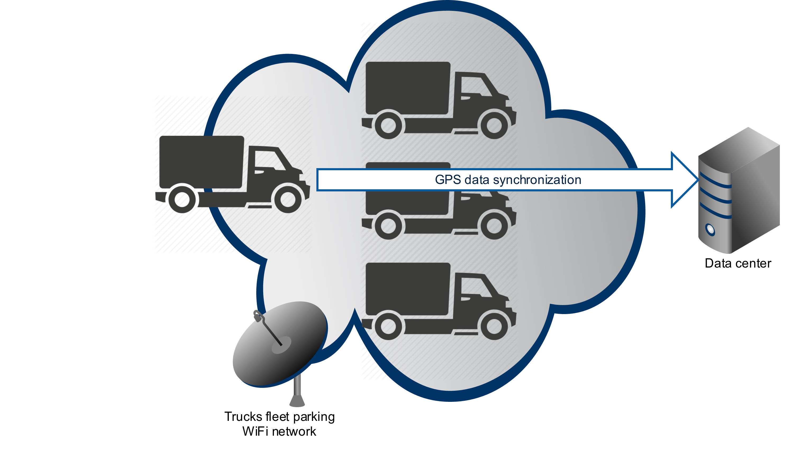</a>

Camel Kura WiFi component can be used to retrieve the information about the WiFi access spots available within the device
range. Under the hood Kura Wifi component uses Kura `org.eclipse.kura.net.NetworkService`. Kura WiFi component
supports both the consumer and producer endpoints.

#### Maven dependency

Maven users should add the following dependency to their POM file:

    <dependency>
      <groupId>io.rhiot</groupId>
      <artifactId>camel-kura</artifactId>
      <version>${rhiot.version}</version>
    </dependency>
    
 Avaliable for rhiot.version >= 0.1.1

#### URI format

    kura-wifi:networkInterface/ssid
    
Where both `networkInterface` and `ssid` can be replaced with the `*` wildcard matching respectively all the network 
interfaces and SSIDs.

For example to read all the SSID available near the device, the following route can be used:

    from("kura-wifi:*/*").to("mock:SSIDs");

The Kura WiFi consumer returns the list of the `org.eclipse.kura.net.wifi.WifiAccessPoint` classes returned as a result
of the WiFi scan:

    WifiAccessPoint[] accessPoints = consumerTemplate.receiveBody("kura:wlan0/*", WifiAccessPoint[].class);
    
You can also request the WiFi scanning using the producer endpoint:

    from("direct:WifiScan").to("kura-wifi:*/*").to("mock:accessPoints");
    
Or using the producer template directly:
 
    WifiAccessPoint[] accessPoints = template.requestBody("kura-wifi:*/*", null, WifiAccessPoint[].class);

#### Options

| Option                    | Default value                                                                 | Description   |
|:------------------------- |:-----------------------------------------------------------------------       |:------------- |
| `accessPointsProvider`    | `com.github.camellabs.iot.component.` `kura.wifi.KuraAccessPointsProvider`    | `com.github.camellabs.iot.component.kura.` `wifi.AccessPointsProvider` strategy instance registry reference used to resolve the list of the access points available to consume. |
| `consumer.initialDelay`   | 1000                                                                          | Milliseconds before the polling starts. |
| `consumer.delay`          | 500 | Delay between each access points scan. |
| `consumer.useFixedDelay`  | false | Set to true to use a fixed delay between polls, otherwise fixed rate is used. See ScheduledExecutorService in JDK for details. |

#### Detecting Kura NetworkService

In the first place `io.rhiot.component.kura.wifi.KuraAccessPointsProvider` tries to locate `org.eclipse.kura.net.NetworkService`
in the Camel registry. If exactly one instance of the `NetworkService`  is found (this is usually the case when
if you deploy the route into the Kura container), that instance will be used by the Kura component. Otherwise new instance of the
`org.eclipse.kura.linux.net.NetworkServiceImpl` will be created and cached by the `KuraAccessPointsProvider`.

### Camel OpenIMAJ component

Camel OpenIMAJ component can be used to detect faces in images.
Camel OpenIMAJ component supports only producer endpoints.

#### Maven dependency

Maven users should add the following dependency to their POM file:

    <dependency>
      <groupId>io.rhiot</groupId>
      <artifactId>camel-openimag</artifactId>
      <version>${rhiot.version}</version>
    </dependency>
    
 Avaliable for rhiot.version >= 0.1.3

#### URI format

    openimaj:label
    
Where `label` can be replaced with any text label:

    from("webcam:spycam").to("openimaj:face-detection");
    
This routes the input stream from the webcam to the openimaj component, 
when a face is detected the resulting body will be an instance of org.openimaj.image.processing.face.detection.DetectedFace,
and List<DetectedFace> when there are multiple faces. 

The component uses a face detector based on the Haar cascade by default, optionally set an alternate detector;
    
    from("webcam:spycam").to("openimaj:face-detection?faceDetector=#anotherDetector");

Using the ProducerTemplate, the following example uses the FKEFaceDetector which is a wrapper around the Haar detector, providing additional 
information by finding facial keypoints on top of the face;
    
    KEDetectedFace face = template.requestBody("openimaj:face-detection?faceDetector=#fkeFaceDetector", inputStream, KEDetectedFace.class);
    FacialKeypoint keypoint = face.getKeypoint(FacialKeypoint.FacialKeypointType.EYE_LEFT_LEFT);
        
    
The confidence in the face detection is set to the low default of 1, you can set the minimum confidence threshold on the endpoint;
    
    from("webcam:spycam").to("openimaj:face-detection?confidence=50");
    

#### Options

| Option                    | Default value                                                                 | Description   |
|:------------------------- |:-----------------------------------------------------------------------       |:------------- |
| `faceDetector`            | `new HaarCascadeDetector()`                                                   | `org.openimaj.image.processing.face.detection.HaarCascadeDetector' is the default face detector |
| `confidence`              | 1                                                                             | The minimum confidence of the detection; higher numbers mean higher confidence.      |

### Camel TinkerForge component

The Camel Tinkerforge component can be used to connect to the TinkerForge brick deamon.

#### Maven dependency

Maven users should add the following dependency to their POM file:

    <dependency>
      <groupId>io.rhiot</groupId>
      <artifactId>camel-tinkerforge</artifactId>
      <version>${rhiot.version}</version>
    </dependency>
 
 Avaliable for rhiot.version >= 0.1.1

#### General URI format

    tinkerforge:/<brickletType>/<uid>[?parameter=value][&parameter=value]

By default a connection is created to the brickd process running on localhost using no authentication.
If you want to connect to another host use the following format:

    tinkerforge://[username:password@]<host>[:port]/<brickletType>/<uid>[?parameter=value][&parameter=value]

The following values are currently supported as brickletType:

* ambientlight
* temperature
* lcd20x4
* humidity
* io4
* io16
* distance
* ledstrip
* motion
* soundintensity
* piezospeaker
* linearpoti
* rotarypoti
* dualrelay
* solidstaterelay

##### Ambientlight

    from("tinkerforge:/ambientlight/al1")
    .to("log:default");

##### Temperature

    from("tinkerforge:/temperature/T1")
    .to("log:default");

##### Lcd20x4

The LCD 20x4 bricklet has a character based screen that can display 20 characters on 4 rows.

###### Optional URI Parameters

| Parameter | Default value | Description                              |
|-----------|---------------|------------------------------------------|
| line      | 0             | Show message on line 0                   |
| position  | 0             | Show message starting at position 0      |

    from("tinkerforge:/temperature/T1
    .to("tinkerforge:/lcd20x4/lcd1?line=2&position=10

The parameters can be overridden for individual messages by settings them as headers on the exchange:

    from("tinkerforge:/temperature/T1
    .setHeader("line", constant("2"))
    .setHeader("position", constant("10"))
    .to("tinkerforge:/lcd20x4/lcd1");

#### Humidity

     from("tinkerforge:/humidity/H1")
     .to("log:default");

#### Io16

The IO16 bricklet has 2 ports (A and B) which both have 8 IO pins. Consuming and producing
messages happens on port level. So only the port can be specified in the URI and the pin will
be a header on the exchange.

##### Consuming:

    from("tinkerforge:/io16/io9?ioport=a")
    .to("log:default?showHeaders=true");

##### Producing

    from("timer:default?period=2000")
    .setHeader("iopin", constant(0))
    .setHeader("duration", constant(1000))
    .setBody(constant("on"))
    .to("tinkerforge:/io16/io9?ioport=b");

### Camel Pi4j component

Camel Pi4j component can be used to manage GPIO and I2C bus features from Raspberry Pi.
This component uses [pi4j](http://pi4j.com) library

#### Maven dependency

Maven users should add the following dependency to their POM file:

    <dependency>
      <groupId>io.rhiot</groupId>
      <artifactId>camel-pi4j</artifactId>
      <version>${rhiot.version}</version>
    </dependency>
    
 Avaliable for rhiot.version >= 0.1.1

#### URI format for GPIO

    pi4j-gpio://gpioId[?options]

*gpioId* must match [A-Z_0-9]+ pattern.
By default, pi4j-gpio uses *RaspiPin* Class, change it via *gpioClass* property
You can use static field name "*GPIO_XX*", pin name "*GPIO [0-9]*" or pin address "*[0-9]*" 

###### Optional URI Parameters

| Parameter            | Default value             | Description                                               |
|----------------------|---------------------------|-----------------------------------------------------------|
| `gpioId`               |                           |                                                           |
| `state`                |                           | Digital Only: if input mode then state trigger event, if output then started value                       |
| `mode`                 | `DIGITAL_OUTPUT`            | To configure GPIO pin mode, Check Pi4j library for more details                     |
| `action`               |                           | Default : use Body if Action for output Pin (TOGGLE, BUZZ, HIGH, LOW for digital only) (HEADER digital and analog) |
| `value`                | `0`                         | Analog or PWN Only                       |
| `shutdownExport`       | `true`                      | To configure the pin shutdown export                      |
| `shutdownResistance`   | `OFF`                       | To configure the pin resistance before exit program                      |
| `shutdownState`        | `LOW`                       | To configure the pin state value before exit program                      |
| `pullResistance`       | `PULL_UP`                   | To configure the input pull resistance, Avoid strange value for info http://en.wikipedia.org/wiki/Pull-up_resistor                     |
| `gpioClass`            | `com.pi4j.io.gpio.RaspiPin` | `class<com.pi4j.io.gpio.Pin>` pin implementation                  |
| `controller`           | `com.pi4j.io.gpio.impl.GpioControllerImpl`            | `instance of <com.pi4j.io.gpio.GpioController>` GPIO controller instance, check gpioClass pin implementation to use the same  |

##### Consuming:

    from("pi4j-gpio://13?mode=DIGITAL_INPUT&state=LOW")
    .to("log:default?showHeaders=true");

##### Producing

    from("timer:default?period=2000")
    .to("pi4j-gpio://GPIO_04?mode=DIGITAL_OUTPUT&state=LOW&action=TOGGLE");
    
    
##### Simple button w/ LED mode

Plug an button on GPIO 1, and LED on GPIO 2 (with Resistor) and code a route like this

    from("pi4j-gpio://1?mode=DIGITAL_INPUT&state=HIGH").id("switch-led")
    .to("pi4j-gpio://2?&action=TOGGLE");

#### URI format for I2C

    pi4j-i2c://busId/deviceId[?options]

###### Optional URI Parameters

| Parameter            | Default value             | Description                                               |
|----------------------|---------------------------|-----------------------------------------------------------|
| `busId`              |                           | i2c bus                                                   |
| `deviceId`           |                           | i2c device                                                |
| `address`            |  `0x00`                   | address to read                                           |
| `readAction`         |                           | READ, READ_ADDR, READ_BUFFER, READ_ADDR_BUFFER            |
| `size`               |  `-1`                     |                                                           |
| `offset`             |  `-1`                     |                                                           |
| `bufferSize`         |  `-1`                     |                                                           |
| `driver`             |                           | cf available i2c driver                                   |

i2c component is realy simplist, for consumer endpoint you can just read byte or buffer byte,
for producer one you can 

for smarter device, you must implement an driver 

###### i2c driver

| Driver            | Feature                                                            |
|-------------------|--------------------------------------------------------------------|
| bmp180            | Temp and Pressure sensor   (http://www.adafruit.com/products/1603) |
| tsl2561           | Light sensor            (http://www.adafruit.com/products/439)     |
| lsm303-accel      | Accelerometer sensor    (http://www.adafruit.com/products/1120)    |
| lsm303-magne      | Magnetometer sensor     (http://www.adafruit.com/products/1120)    |
| mcp23017-lcd      | LCD 2x16 char           (http://www.adafruit.com/products/1109)    |

### Camel PubNub component

Camel PubNub component can be used to communicate with the [PubNub](http://www.pubnub.com) data stream network for connected devices. 
This component uses [pubnub](https://www.pubnub.com/docs/java/javase/javase-sdk.html) library

#### Maven dependency

Maven users should add the following dependency to their POM file:

    <dependency>
      <groupId>io.rhiot</groupId>
      <artifactId>camel-pubnub</artifactId>
      <version>${rhiot.version}</version>
    </dependency>
    
 Avaliable for rhiot.version >= 0.1.1

#### General URI format

    pubnub://<pubnubEndpointType>:channel[?options]

The following values are currently supported as pubnubEndpointType:

* pubsub
* presence

###### URI Parameters

| Option                    | Default value                                                                 | Description   |
|:------------------------- |:-----------------------------------------------------------------------       |:------------- |
| `publisherKey`            |                      | The punub publisher key optained from pubnub. Mandatory for publishing events              |
| `subscriberKey`           |                      | The punub subsciber key optained from pubnub. Mandatory when subscribing to events         |
| `secretKey`               |                      | The pubnub secret key.
| `ssl`                     | true                 | Use SSL transport. |
| `uuid`                    |                      | The uuid identifying the connection. If not set it will be auto assigned |
| `operation`               | PUBLISH              | Producer only. The operation to perform when publishing events or ad hoc querying pubnub. Valid values are HERE_NOW, WHERE_NOW, GET_STATE, SET_STATE, GET_HISTORY, PUBLISH |

Operations can be used on the producer endpoint, or as a header:

| Operation                 | Description   |
|:------------------------- |:------------- |
| `PUBLISH`                 | Publish a message to pubnub. The message body shold contain a instance of  `org.json.JSONObject` or `org.json.JSONArray`. Otherwise the message is expected to be a string.
| `HERE_NOW`                | Read presence (Who's online) information from the endpoint channel.|  
| `WHERE_NOW`               | Read presence information for the uuid on the endpoint. You can override that by setting the header `CamelPubNubUUID` to another uuid. | 
| `SET_STATE`               | Set the state by uuid. The message body should contain a instance of `org.json.JSONObject` with any state information. By default the endpoint uuid is updated, but you can override that by setting the header `CamelPubNubUUID` to another uuid. |
| `GET_STATE`               | Get the state object `org.json.JSONObject` by for the endpoint uuid. You can override that by setting the `CamelPubNubUUID` header to another uuid. |
| `GET_HISTORY`             | Gets the message history for the endpoint channel. | 

##### Consuming:

Route that consumes messages from mychannel:

    from("pubnub://pubsub:mychannel?uuid=master&subscriberKey=mysubkey").routeId("my-route")
    .to("log:default?showHeaders=true");
    
Route that listens for presence (eg. join, leave, state change) events on a channel

    from("pubnub://presence:mychannel?subscriberKey=mysubkey").routeId("presence-route")
    .to("log:default?showHeaders=true");

##### Producing

Route the collect data and sendt it to pubnub channel mychannel:

    from("timer:default?period=2000").routeId("device-event-route")
    .bean(EventGeneratorBean.class, "getEvent()")
    .convertBodyTo(JSONObject.class)
    .to("pubnub://pubsub:mychannel?uuid=deviceuuid&publisherKey=mypubkey");
    

### Camel Webcam component

Camel [Webcam](http://webcam-capture.sarxos.pl/) component can be used to capture still images and detect motion.
With Camel Webcam you can connect a camera to your device's USB port, or install the camera mod on the Raspberry Pi board for example, 
and poll for an image periodically and respond to motion events.
The body of the message is the current image as a BufferedInputStream, while motion events are stored in the header 'io.rhiot.webcam.webcamMotionEvent'. 
This event may be useful for getting the image captured prior to the motion event, as well the Points where the motion occurred and the center of motion gravity. 

#### Maven dependency

Maven users should add the following dependency to their POM file:

    <dependency>
      <groupId>io.rhiot</groupId>
      <artifactId>camel-webcam</artifactId>
      <version>${rhiot.version}</version>
    </dependency>
    
Avaliable for rhiot.version >= 0.1.2

#### URI format

The Camel endpoint URI format for the Webcam consumer is as follows:

    webcam:label
    
Where `label` can be replaced with any text label:

    from("webcam:spycam").
      to("file:///var/spycam");
      
This route creates a scheduled consumer taking 1 frame per second and writes it to file in the PNG format.

Alternatively, respond to motion events by setting the endpoint parameter 'motion' to true.

    from("webcam:spycam?motion=true").
      to("file:///var/spycam");
      
You can also poll the webcam for a single image, for example;

    from("jms:webcam").
      to("webcam:spycam");
      
Specify the resolution with custom width and height, or the resolution name;

    from("webcam:spycam?resolution=HD720").
      to("seda:cam")
      
#### Options

| Option                   | Default value                                                                 | Description   |
|:-------------------------|:-----------------------------------------------------------------------       |:------------- |
| `consumer.deviceName`    |                                                                               | Specify the webcam device name, if absent the first device available is used, eg /dev/video0.  |
| `consumer.format`        | PNG                                                                           | Capture format, one of 'PNG,GIF,JPG'  |
| `consumer.initialDelay`  | 1000                                                                          | Milliseconds before the polling starts. Applies only to scheduled consumers. |
| `consumer.motion`        | false                                                                         | Whether to listen for motion events.                                |
| `consumer.motionInterval`| 500                                                                           | Interval in milliseconds to detect motion.                               |
| `consumer.pixelThreshold`| 25                                                                            | Intensity threshold when motion is detected (0 - 255)  |
| `consumer.areaThreshold` | 0.2                                                                           | Percentage threshold of image covered by motion (0 - 100)  |
| `consumer.motionInertia` | -1 (2 * motionInterval)                                                       | Motion inertia (time when motion is valid)  |
| `consumer.resolution`    | QVGA                                                                          | Resolution to use (PAL, HD720, VGA etc)     |
| `consumer.width`         | 320                                                                           | Resolution width, note that resolution takes precendence.  |
| `consumer.height`        | 240                                                                           | Resolution height, note that resolution takes precendence.  |
| `consumer.delay`         | 1000                                                                          | Delay in milliseconds. Applies only to scheduled consumers.  |
| `consumer.useFixedDelay` | false | Set to true to use a fixed delay between polls, otherwise fixed rate is used. See ScheduledExecutorService in JDK for details. |

#### Process manager

Process manager is also used by the Webcam component to execute Linux commands responsible for starting the webcam driver and  
configuring the image format and resolution. If for some reason you would like to change
the default implementation of the process manager used by Camel (i.e. `io.rhiot.utils.process.DefaultProcessManager`),
you can set it on the component level:

    WebcamComponent webcam = new WebcamComponent();
    webcam.setProcessManager(new CustomProcessManager());
    camelContext.addComponent("webcam", webcam);

If custom process manager is not set on the component, Camel will try to find the manager instance in the
[registry](http://camel.apache.org/registry.html). So for example for Spring application, you can just configure
the manager as the bean:

    @Bean
    ProcessManager myProcessManager() {
        new CustomProcessManager();
    }

Custom process manager may be useful if your Linux distribution or camera requires executing some unusual commands
in order to load the v4l2 (Video for Linux) module.

#### Installer

For some Linux+webcam combinations, the webcam component requires `v4l-utils` and its dependencies to be installed on an
operating system. By default the Webcam component installs `v4l-utils` using apt-get, you can configure the installer or 
set an alternate one on the component:
    
    WebcamComponent webcam = new WebcamComponent();
    webcam.setInstaller(new BrewInstaller());
    camelContext.addComponent("webcam", webcam);    
    
You can also specify alternate dependencies for your platform, if your platform uses my-custom-v4l-utils, configure the component as follows:

    WebcamComponent webcam = new WebcamComponent();
    webcam.setRequiredPackages("my-custom-v4l-utils");  //comma-separated list of packages to install
    camelContext.addComponent("webcam", webcam);    
    
If an Installer is not set on the component, Camel will try to find an instance in the
[registry](http://camel.apache.org/registry.html). So for example for Spring application, you can configure the installer as a bean:

    @Bean
    Installer myInstaller() {
        CustomInstaller installer = new CustomInstaller();
        installer.setTimeout(60000 * 10); //Allow up to 10 minutes to install packages
    }

By default an installer ignores problems with the webcam packages installation and only logs the warning using a
logger WARN message. If you would like the component to thrown an exception instead of logging a message, set 
`ignoreInstallerProblems` property of the `WebcamComponent` to `true`:

    WebcamComponent webcam = new WebcamComponent();
    webcam.setIgnoreInstallerProblems(true);
    camelContext.addComponent("webcam", webcam); 

## Rhiot Cloud

The Internet of Things is all about the communication and messaging. The devices connected to the IoT system have to
connect to the kind of centralized hub that allows them to exchange their data with the other devices and backend
services. The device that can't be properly connected to the rest of the application ecosystem, is useless from the IoT point
 of view.

If you are looking for such centralized event hub, Rhiot project provides such central bus in the form of the
*Rhiot Cloud*. Rhiot Cloud is the set of the backend (micro)services and UI application used to managed these.

### Architecture

The high-level architecture diagram of the Rhiot Cloud is presented on the image below:

 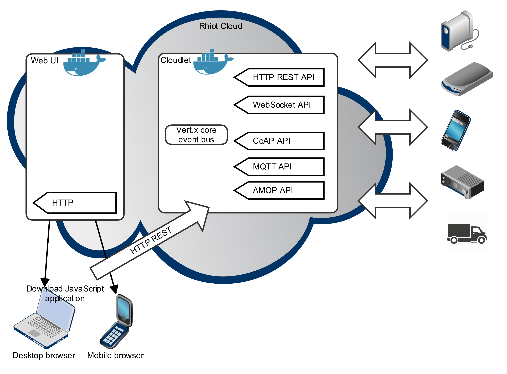

*Cloudlets* are server-side microservices that come with some common functionalities required by the IoT systems. *Cloudlets
UI plugins* are [Hawt.io](http://hawt.io)-based plugins which provides spiffy web UI for the cloudlets back-end services. *Cloudlet
Console* is the web application assembling all the Cloudlets UI plugins. The *Rhiot Cloud* then is the
complete cloud-based installation setup including Cloudlet Console, Cloudlets backend services and all the other necessary
services (like database servers) deployed to the server of your choice.

Notice that we assume that cloudlets are dockerized and deployed as the Docker containers. Also the HTTP REST API has been listed
at the top of the diagram not without the reason - we think of the REST API as the first-class citizen considering the
access to the Rhiot Cloud.

### Dockerized Rhiot Cloud

We recommend to run the Rhiot Cloud using the Docker container. We love Docker and believe that containers are the
future of the applications deployment. To install the Rhiot Cloud on the Linux server of your choice, just execute the
following command:

    GOOGLE_OAUTH_CLIENT_ID=foo.apps.googleusercontent.com \
    GOOGLE_OAUTH_CLIENT_SECRET=yourSecret \
    GOOGLE_OAUTH_REDIRECT_URI=http://myapp.com \
      bash <(curl -s https://raw.githubusercontent.com/rhiot/rhiot/master/cloudlets/deployment/rhiot-cloud.sh)

The script above installs the proper version of Docker server. Keep in mind that the minimal Docker version required by
Rhiot Cloud is 1.8.2 - if the older version of the Docker is installed, our script will upgrade your Docker server. After
Docker server is properly installed, our script downloads and starts the Cloudlet Console, device management cloudlet,
geofencing cloudlet and MongoDB server containers.

By default Rhiot Cloud runs the console UI using the development HTTP port 9000. If you want to change it, use the `HTTP_PORT`
environment variable:

    HTTP_PORT=80 \
      ...
      bash <(curl -s https://raw.githubusercontent.com/rhiot/rhiot/master/cloudlets/deployment/rhiot-cloud.sh)

Environment variables starting with `GOOGLE_OAUTH` prefix are used to configure the Google OAuth authentication
used by the Cloudlet Console. You have to create the Google application in the
[Developers Console](https://console.developers.google.com) to get your client identifier, secret and configure the
accepted redirect URIs. If `GOOGLE_OAUTH_REDIRECT_URI` variable is net given, `http://localhost:9000` will be used.

Rhiot Cloud relies on the MongoDB to store some of the data processed by it. For example MongoDB backend is the default
store used by the device management cloudlet's Leshan server. By default the MongoDB data is stored in the `mongodb_data`
volume container. If such volume doesn't exist, Rhiot Cloud script will create it for you.

### Device management cloudlet

The foundation of the every IoT solution is the device management system. Without the centralized coordination of your
*things*, you can't properly orchestrate how your devices communicate with each other. Also the effective monitoring of
the IoT system, without the devices registered in the centralized cloud, becomes almost impossible.

Device Management Cloudlet provides backend service for registering and tracking devices connected to the Rhiot Cloud.
Under the hood Device Management Cloudlet uses [Eclipse Leshan](https://projects.eclipse.org/projects/iot.leshan), the
open source implementation of the [LWM2M](https://en.wikipedia.org/wiki/OMA_LWM2M) protocol. LWM2M becomes the standard
for the IoT devices management so we decided to make it a heart of the Rhiot device service.

The diagram below presents the high-level overview of the device cloudlet architecture.

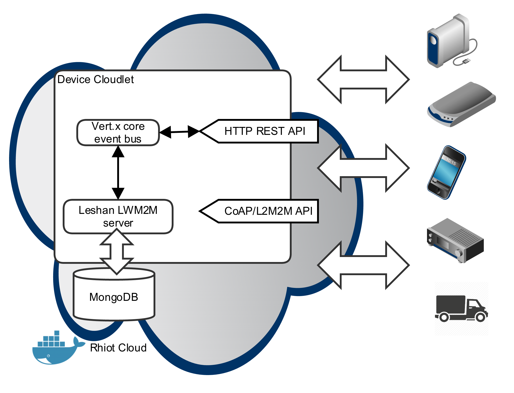

#### Running the device management cloudlet

The device management cloudlet is distributed as a fat jar. Its Maven coordinates are
`io.rhiot/rhiot-cloudlet-device/0.1.1`. The dockerized artifact is available in Docker Hub as
[rhiot/cloudlet-device:0.1.1](https://hub.docker.com/r/rhiot/cloudlet-device). In order to start the device management
microservice, just run it as a fat jar...

    java -jar rhiot-cloudlet-device:0.1.1.jar

...or as the Docker container...

    docker run -d io.rhiot/cloudlet-device/0.1.1

#### Device management REST API

The device management cloudlet exposes REST API that can be used to work with the devices. By default the device
management REST API is exposed using the following base URI - `http:0.0.0.0:15000`. You can change the port of the
REST API using the `api_rest_port` environment variable. For example the snippet below exposes the REST API on the port
16000:

    docker run -d -e api_rest_port=16000 -p 16000:16000 io.rhiot/cloudlet-device/0.1.1

##### Listing devices

To list the devices registered to the cloud (together with their metadata) send the `GET` request to the
`/device` URI. For example executing the following command returns the list of the devices in the form of the list
serialized to the JSON format:

    $ curl http://rhiot.net:15000/device
    {"devices":
      [{"registrationDate":1439822565254,
      "address":"127.0.0.1",
      "port":1103,
      "registrationEndpointAddress":"0.0.0.0:5683",
      "lifeTimeInSec":86400,
      "lwM2mVersion":"1.0",
      "bindingMode":"U",
      "endpoint":"myFancyDevice",
      "registrationId":"7OjdvHCVUb",
      "objectLinks":[{"url":"/",
        "attributes":{"rt":"oma.lwm2m"},
        "path":"/"},
        ...],
      "alive":true}]}

##### Reading particular device's metadata

In order to read the metadata of the particular device identified with the given ID, send the `GET` request to the `/device/ID`
URI. For example to read the metadata of the device with the ID equal to `myDevice001`, execute the following command:

    $ curl http://rhiot.net:15000/device/myDevice001
    {"device":
      {"registrationDate":1441959646566,"address":"127.0.0.1","port":1111,
      "registrationEndpointAddress":"0.0.0.0:5683", "lifeTimeInSec":31536000,
      "lwM2mVersion":"1.0","bindingMode":"U","endpoint":"myDevice001",
      "registrationId":"2OMPXtg6lX", "objectLinks": ... ,"alive":true}
    }

##### Disconnected devices

Devices registered in the Rhiot cloud can be in the *connected* or *disconnected* status. Connected devices can exchange
messages with the cloud, while disconnected can't. Disconnection usually occurs when device temporarily lost the network
connectivity.

To return the list of identifiers of the disconnected devices send the `GET` request to the following URL -
`/device/disconnected`. In the response you will receive the list of the identifiers of the devices
that have not send the heartbeat signal to the device management cloudlet for the given *disconnection period* (one minute by
default). The list will be formatted as the JSON document similar to the following one:

    $ curl http://rhiot.net:15000/device/disconnected
    {"disconnectedDevices": ["device1", "device2", ...]}

The disconnection period can be changed globally using the `disconnectionPeriod` environment variable indicating the
disconnection period value in miliseconds. For example the snippet below sets the disconnection period to 20 seconds:

    docker run -d -e disconnectionPeriod=20000 io.rhiot/cloudlet-device/0.1.1

The device which is running and operational should periodically send the hearbeat signal to the device cloudlet in order to avoid
being marked as disconnected. You can do it be sending the `GET` request to the
`/device/DEVICE_ID/heartbeat` URI. If the heartbeat has been successfully send to the cloud,
you will receive the HTTP response similar to the following one:

    $ curl http://rhiot.net:15000/device/myDeviceID/heartbeat
    {"status": "success"}

Keep also in mind that sending the regular LWM2M update by the client device to the LWM2M server works the same as sending
the heartbeat update via the REST API.

##### Deregistering all the devices

In order to deregister all the devices from the cloud, send the `DELETE` request to the `/device` URI. For example:

    $ curl -XDELETE http://rhiot.net:15000/device
    {"status":"success"}

##### Deregistering single device

Sometimes you would like to explicitly remove the particular registered device from the cloudlet database. In such case execute the
`DELETE` request against the `/device/DEVICE_ID` URI. For example to remove the device with the ID equal to `foo`, execute
the following command:

    $ curl -XDELETE http://rhiot.net:15000/device/foo
    {"status":"success"}

##### Reading device's details

LWM2M protocol allows you to read the values of the various metrics from the managed device. The basic metrics includes
device's manufacturer name, model, serial number, firmware version and so forth. In order to read the device details,
send `GET` request to the `/device/myDeviceID/details` URI. For example to read the details of the device
identified by the `myDeviceID`, execute the following command:

    $ curl http://rhiot.net:15000/device/myDeviceID/details
    {"deviceDetails":
      {"serialNumber":"Serial-0cc28150-3a09-4acc-b12d-d9101b8a29d2",
      "modelNumber":"Virtual device",
      "firmwareVersion":"1.0.0",
      "manufacturer":"Rhiot"}
    }

The `/device/ID/details` call connects to the given device, collects the metrics and returns those metrics wrapped into
the JSON response. You can also collect individual metrics using the following URIs:

| Metric                   | URI                      | Description   |
|:-------------------------|:-------------------------       |:------------- |
| Manufacturer | `/device/deviceId/manufacturer`                | Device's manufacturer. For example `Raspberry Pi`. |
| Model number         | `/device/deviceId/modelNumber` | Device's model. For example `2 B+`. |
| Serial number | `/device/deviceId/serialNumber` | Unique string identifying the particular piece of the hardware. |
| Firmware number   | `/device/deviceId/firmwareVersion`  | The text identifying the version of the software that device is running. Can include both operating system and applications' versions. |

For example to read the version of the software used by your device, execute the following `GET` request:

     $ curl http://rhiot.net:15000/device/foo/firmwareVersion
    {"firmwareVersion":"1.0.0"}

Keep in mind that the metric values read by these operations are saved to the metrics database and can be accessed later on
(see [Devices Data Analytics](https://github.com/rhiot/rhiot/blob/master/docs/readme.md#devices-data-analytics)). Also if
the device is disconnected at the moment when the REST API is called, the value will be read from the metrics history database,
instead of the real device. If there is no historical value available for the given device and metric, the
`unknown - device disconnected` value will be returned for it. For example:

     $ curl http://rhiot.net:15000/device/foo/firmwareVersion
    {"firmwareVersion":"unknown - device disconnected"}

##### Creating virtual devices

Device Cloudlet offers you the option to create the *virtual devices*. Virtual devices can be used to represent the clients which
can't use LWM2M API. For example the Android phone could use REST calls only to create and maintain the projection of
itself as the virtual device even if you can't install LWM2M client on that device.

To create the virtual device, send the `POST` request to the `/client` URI. For example:

    curl -X POST -d '{ "clientId": "myVirtualDeviceId"}' http://rhiot.net:15000/client
    {"Status":"Success"}%

Starting from this point your the virtual device identified as `myVirtualDeviceId` will be registered in the device
cloudlet LWM2M server. And of course you can send the heartbeats signals to the virtual device to indicate that the
device is still connected to the Rhiot Cloud.

    $ curl http://rhiot.net:15000/device/myDeviceID/heartbeat
    {"status": "success"}

##### Intercepting REST API requests

If you would like to intercept the HTTP communication between the HTTP client and the REST API (for example in order to add the
security checks), just add your custom implementation of the
[`HttpExchangeInterceptor`](https://github.com/rhiot/rhiot/blob/master/vertx/src/main/groovy/io/rhiot/vertx/web/HttpExchangeInterceptor.groovy)
interface to your classpath...

    package com.example

    import io.rhiot.vertx.web.HttpExchangeInterceptor
    import io.vertx.groovy.ext.web.RoutingContext

    public class MockHttpExchangeInterceptor implements HttpExchangeInterceptor {

        @Override
        public void intercept(RoutingContext routingContext) {
            String token = routingContext.request().getHeader('security_token');
            if(...) { // token is not valid
                routingContext.response().end("Invalid security token!");
            }
        }

    }

...and set the `application_package` property to the base package of your application. For example for the snippet
above the base package could be set as follows:

    docker run -d -e application_package=com.example com.example/rhiot-cloudlet-device-customized

#### Device management web UI

Rhiot Cloudlet Console is the web user interface on the top of the device management REST API. The web UI makes it easier
to monitor and manage your devices using the web brower, the mobile phone or the tablet.

##### Listing devices

To list the devices
using the cloudlet console navigate to the `Devices` tab. You will see the list of the devices registered to the
device management cloudlet. Devices with the icon representing white (empty) heart are the disconnected ones.

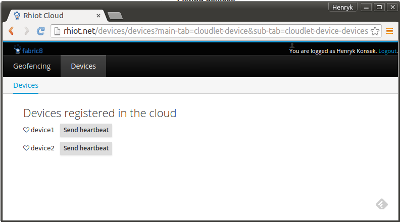

##### Sending heartbeat to the device

In order to send heartbeat message to the given device and make it visible as connected again, you can use the
`Send heartbeat` button near the device's icon.

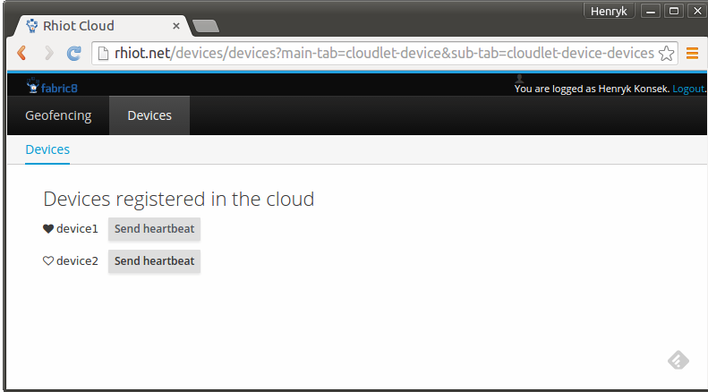

##### Deregistering devices

If you would like deregister the device from the cloud, click the `Deregister` button near the device icon.

##### Listing device details

If you click on the device name, the web UI will fetch and display the device details metrics:

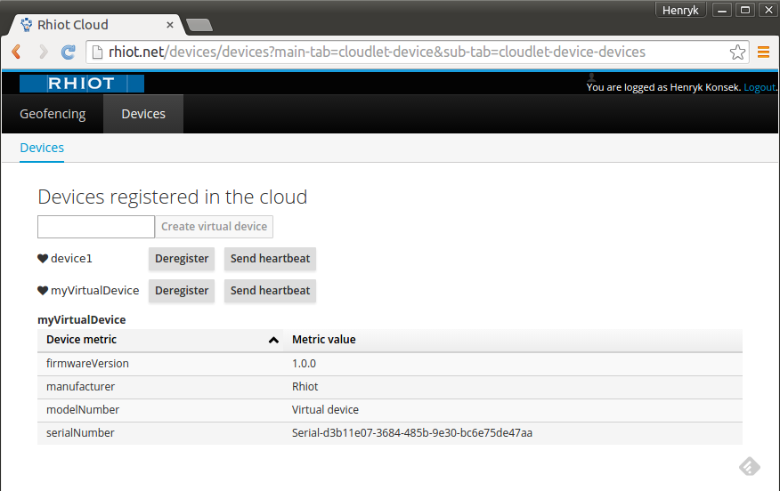

##### Creating virtual devices

If you don't have any devices nearby at the moment and still want to play with the Device management Cloudlet, don't
worry - you can still create the new virtual device using the web UI.

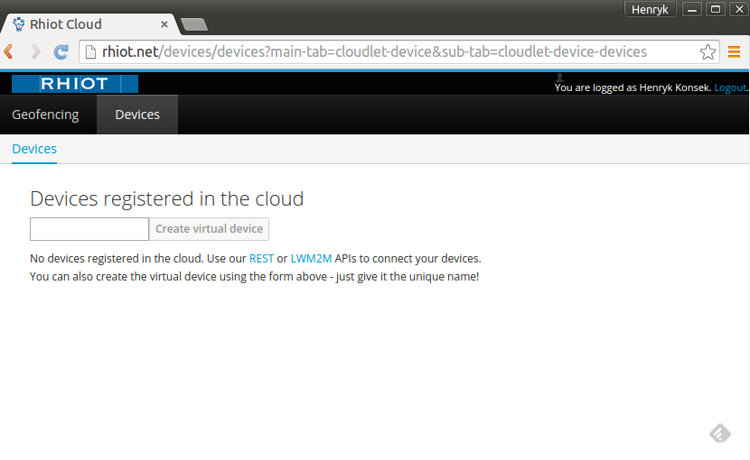

All you need to do is to enter the unique identifier of the device:

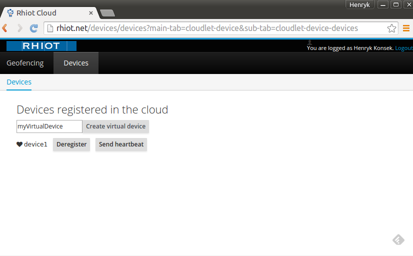

The device will be registered in the Rhiot Cloud and visible as soon as you click the `Create virtual device` button.

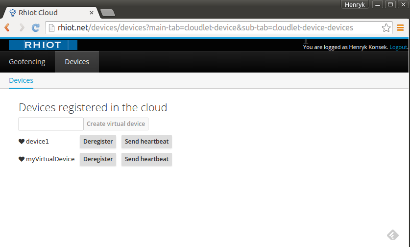

#### Accessing LWM2M server directly

While we suggest to use the universal REST API whenever possible, you can definitely use the LWM2M server directly.
By default the LWM2M server API is exposed using the default IANA port i.e. 5683. The embedded LWM2M server is started
together with the cloudlet.

In order to use custom LWM2M server port, set the `lwm2m_port` environment variable when starting the device
management cloudlet (or Rhiot Cloud). For example:

    docker run -d -e lwm2m_port=16000 -p 16000:16000 io.rhiot/cloudlet-device/0.1.1

#### Device registry

Device registry is used by Leshan to store the information about the managed devices. By default the device cloudlet uses
the MongoDB registry. The MongoDB client can be configured using the [Steroids MongoDB module](https://github.com/rhiot/rhiot/blob/master/docs/readme.md#injecting-mongodb-client).

##### Registry cache

As the access to the device information is crucial for all the IoT systems, it should have been implemented as efficiently
as possible. As devices information doesn't change very often, it should be cached in the memory whenever possible. Device
Management Cloudlet uses the [Infinispan](http://infinispan.org) cache cluster under the hood, to provide the faster access
to the device information. The Infinispan cache used is clustered using JGroups, so the cached information
remains up-to-date even when many Device Manager Cloudlet instances are executed in the cluster.

#### Clustering Device Management Cloudlet

Device Management Cloudlet has been designed with the scalability in mind. Default configuration of the cloudlet allows
you to run it in the cluster, behind the load balancer of your choice. The default MongoDB device registry will be
shared by all the cloudlet instances in the cluster. Also the device registry cache used internally by Device Management Cloudlet
will be automatically synchronized between the deployed cloudlet instances. All you need to do, is to be sure that you have
the [IP multicast](https://en.wikipedia.org/wiki/IP_multicast) enabled for your local network, so the JGroups cluster can
be established between the cloudlet instances.

Keep in mind that each clustered instance of the Device Management Cloudlet exposes both REST and LWM2M API, so you can
take advantage of load balancing over all the APIs available.

#### Devices data analytics

LWM2M protocol provides you the way to read the metrics' values from the devices. However in order to perform the search
queries against those values, you have to store those in a centralized storage. For example if you would like to find all the
devices with the firmware version smaller than `x.y.z`, you have to store all the firmware version of your devices in
the centralized database, then execute a query against that database. Otherwise you will be forced to connect to the all of
your devices using the LWM2M protocol and ask each device to provide its firmware version number. Asking millions of
the devices connected to your system to provide you their firmware version is far from the ideal in the terms of the
efficiency.

The device cloudlet stores each device metric value read from the LWM2M server via the REST API in the dedicated analytics
store. It basically means that whenever you call the REST API to read the device metric, the value read from the
device is stored in the database. For example the following API call will not only return the firmware version of the
device identified by `myDevice`, but also will remember this value in the analytics database:

    $ curl http://rhiot.net/device/myDevice/firmwareVersion
    {"firmwareVersion": "1.0.0"}

By default the historical metrics data is saved in the [MongoDB](https://www.mongodb.org) database. The default database name is
`DeviceCloudlet`, while the historical values of the read metrics are saved to the `DeviceMetrics` collection. Device
Cloudlet reuses the MongoDB connection settings used by the MongoDB LWM2M device registry store.

### Geofencing cloudlet

Geofencing cloudlet provides backend cloud service for collecting and the basic analysis of the GPS data.

## Performance Testing Framework

The key part of the process of tailoring the perfect IoT solution is choosing the proper hardware for the gateway device.
In general the more expensive gateway hardware is, the more messages per second you can process. However the more
expensive the gateway device is, the less affordable your IoT solution becomes for the end client. That is the main
reason why would you like to have a proper tool for measuring the given IoT messages flow scenario in the unified way,
on multiple devices.

Rhiot project comes with the *Performance testing framework* that can be used to define the hardware profile and
test scenarios. Performance framework takes care of detecting the devices connected to your local network, deploying the
test application into these, executing the actual tests and generating the results as the human-readable chart.
For example the sample output for the MQTT QOS testing could generate the following diagram:

Performance Testing Framework excels when you would like to answer the following question - how the different field hardware setups
perform against the given task. Just connect your devices to the local network, execute the performance testing application
and compare the generated diagrams.

### Hardware profiles

This section covers the *hardware profiles* for the performance tests. Profiles are used to describe the particular
hardware configuration that can be used as a target device for the performance benchmark. Every performance test
definition can be executed on the particular hardware profiles.

#### Raspberry PI 2 B+ (aka RPI2)

The `RPI2` hardware profile is just the Raspberry Pi 2 B+ model equipped with the network connector (WiFi adapter or
the ethernet cable). Currently we assume that the device is running [Raspbian](https://www.raspbian.org/) operating
system (version 2015-05-05).

#### Raspberry PI 2 B+ with BU353 (aka RPI2_BU353)

The `RPI2_BU353` hardware profile is the same as `RPI2` profile, but additionally equipped with the
[BU353 GPS receiver](http://usglobalsat.com/p-688-bu-353-s4.aspx#images/product/large/688_2.jpg)
plugged into the USB port.

### Running the performance tester

The easiest way to run the performance benchmark is to connect the target device (for example Rapsberry Pi) into your
local network (for example via the WiFi or the Ethernet cable) and start the tester as a Docker container, using the
following command:

    docker run -v=/tmp/gateway-performance:/tmp/gateway-performance --net=host rhiot/performance-of RPI2

Keep in mind that `RPI2` can be replaced with the other supported hardware profile (like `RPI2_BU353`). The performance
tester detects the tests that can be executed for the given hardware profile, deploy the gateway software to the target
device, executes the tests and collects the results.

When the execution
of the benchmark ends, the result diagrams will be located in the `/tmp/gateway-performance` directory (or any other
directory you specified when executing the command above). The sample diagram may look as follows:

Keep in mind that currently we assume that your Raspberry Pi has the default Raspbian SSH account available (username: *pi* / password: *raspberry*).

### Analysis of the selected tests results

Below you can find some performance benchmarks with the comments regarding the resulted numbers.

#### Mock sensor to the external MQTT broker

In this test we generate mock sensor events in the gateway using the timer trigger. The message is the random UUID encoded
to the array of bytes. Then we send those messages to the
external MQTT broker. We test and compare various MQTT QOS levels. The MQTT client used to send the messages is
[Eclipse Paho](https://www.eclipse.org/paho/).

#### Sample results for the RPI2 hardware kit

The very first question that comes to the mind when you look at these benchmarks is why there is so huge difference between
the MQTT QOS level 0 and the other QOS levels? The reason is that currently Eclipse Paho client doesn't work well with
QOS greater than 0 and the high messages load. The reason for that is that Paho client enforces inflight messages limit to 10. This
is pretty restrictive treshold considering that MQTT client should have more time for receiving the acknowledgement from the
MQTT server. Such acknowledgement is required for the MQTT QOS levels greater than 0. Waiting for the acknowledge reply
from the server increases the number of the inflight messages hold by the Paho client. As a result Paho client
throughput for QOS 1 and 2 is limited for the extremely large number of messages.

Regardless of the current Paho limits (that are very likely to be changed in the future), the overall performance of the
MQTT client is really great. As the majority of the gateway solutions can safely uses the QOS 0 for forwarding the data
from the field to the data center (as losing the single message from the stream of the sensors data, is definitely acceptable).
Almost 1800 messages per second for QOS 0 and around 500 messages per second for the highest QOS 2 is really good result
considering the class of the Raspberry Pi 2 hardware.

## Steroids configuration framework

Under the hood Rhiot uses the *steroids* configuration framework. Steroids is the small framework developed as the part
of the Rhiot in order to provide the simple, yet extensible base for the dependency injection and configuration.

The key principles behind the steroids are:
* promote singleton usage
* promote configuration via environment variables and system properties
* promote [Kubernetes-like service discovery](https://github.com/kubernetes/kubernetes/blob/master/docs/user-guide/services.md)
* promote loading reloadable resources from the external sources (like files and databases)

### Reading application properties

Almost all components of Rhiot uses the `io.rhiot.utils.Properties` class to read the application properties. That
properties utility can be used to resolve the value of the given application property. For example:

    String property = Properties.stringProperty("myProperty");
    String property = Properties.stringProperty("myProperty", "defaultValue");

`Properties` provides methods not only for the String properties, but also for the primitive data types. For example:

    Integer timeout = Properties.intProperty("timeout");
    int timeout = Properties.intProperty("timeout", 1000);

The `Properties` tries to resolve the property value from the following locations (and in this order):
* ThreadLocal map 
* JVM system properties
* environment variables
* `application.properties` file located in the classpath

### Steroids bootstrap

Steroids Bootstrap is a small engine that can be used to scan the classpath and automatically load steroids modules.
Bootstrap provides opinionated *convention over configuration* runtime simplifying the wiring between common components
used in Rhiot-based applications.

In order to start using bootstrap, add the following Maven dependency to your project:

    <dependency>
        <groupId>io.rhiot</groupId>
        <artifactId>rhiot-steroids</artifactId>
        <version>${rhiot.version}</version>
    </dependency>

Avaliable for rhiot.version >= 0.1.2

And then add the following code to your project:

    import io.rhiot.steroids.bootstrap.Bootstrap;
    ...
    Bootstrap bootstrap = new Bootstrap().start();
    ... // Do your stuff
    bootstrap.stop();

You can also use our main class (which is particularly useful when working with the fat jars):

    import io.rhiot.steroids.bootstrap.Bootstrap;
    ...
    Bootstrap.main();

### Injecting MongoDB client

Steroids come with the MongoDB module that can be used to simplify access to the MongoDB database. In order to take the
advantage from it, import the `rhiot-mongodb` module into your project:

    <dependency>
        <groupId>io.rhiot</groupId>
        <artifactId>rhiot-mongodb</artifactId>
        <version>${rhiot.version}</version>
    </dependency>

Avaliable for rhiot.version >= 0.1.1

In order to inject the MongoDb client into your code, use the `Mongos.discoverMongo()` method:

    import io.rhiot.mongodb.Mongos;
    ...
    MongoClient mongo = Mongos.discoverMongo();

If `MONGODB_SERVICE_HOST` environment variable (or system property) is not specified, the `Mongos` will try to connect to
the `mongodb` and `localhost` hosts respectively, using default MongoDB port (`27017`) or the one specified by the `MONGODB_SERVICE_HOST`
environment variable (or system property).

By default MongoDB client will be configured to timeout the connection attempt after 1 second (yes, we like to fail fast).
You can change timeout value by setting `MONGODB_CONNECT_TIMEOUT` the environment variable (or system property) to the desired number
of timeout miliseconds. For example to set the connection timeout to 30 seconds you can use the following code:

    System.setProperty("MONGODB_CONNECT_TIMEOUT", TimeUnit.SECONDS.toMillis(30) + "");
    MongoClient mongo = Mongos.discoverMongo();

## Quickstarts

Rhiot comes with the set of quickstarts - the sample projects that can be used as the building blocks of your IoT
solution. Quickstarts are hosted at GitHub ([rhiot/quickstarts](https://github.com/rhiot/quickstarts)) and can be
downloaded using the following shell command:

    git clone git@github.com:rhiot/quickstarts.git

### AMQP cloudlet quickstart

The AMQP cloudlet quickstart can be used as a base for the fat-jar AMQP microservices. If you wanna create a simple
backend application capable of exposing AMQP-endpoint and handling the AMQP-based communication, the AMQT cloudlet
quickstart is the best way to start your development efforts.

#### Creating and running the AMQP cloudlet project

In order to create the AMQP cloudlet project execute the following commands:

    git clone git@github.com:rhiot/quickstarts.git
    cp -r quickstarts/cloudlets/amqp amqp
    cd amqp
    mvn install

To start the AMQP cloudlet execute the following command:

    java -jar target/rhiot-cloudlets-amqp-1.0.0-SNAPSHOT.jar

You can also build and run it as a Docker image (we love Docker and highly recommend this approach):

    TARGET_IMAGE=yourUsername/rhiot-cloudlets-amqp
    mvn install docker:build docker:push -Ddocker.image.target=${TARGET_IMAGE}
    docker run -it ${TARGET_IMAGE}

#### AMQP broker

By default AMQP cloudlet quickstart starts embedded [ActiveMQ](http://activemq.apache.org) AMQP broker (on
5672 port). If you would like to connect your cloudlet application to the external ActiveMQ broker (instead of starting
the embedded one), run the cloudlet with the `BROKER_URL` environment variable or system property, for example:

    java -DBROKER_URL=tcp://amqbroker.example.com:61616 -jar target/rhiot-cloudlets-amqp-1.0.0-SNAPSHOT.jar

...or...

    docker run -e BROKER_URL=tcp://amqbroker.example.com:61616 -it yourUsername/rhiot-cloudlets-amqp

#### Sample chat application

The AMQP cloudlet quickstart is in fact a simple chat application. Clients can send the messages to the chat channel
by subscribing to the broker and sending the messages to the `chat` AMQP queue.

The clients can subscribe to the chat updates
by listening on the `chat-updates` AMQP topic - whenever the new message has been sent to the chat channel, the clients registered
to the `chat-updates` will receive the updated chat history.

The quickstart also exposes the simple REST API that can be used to read the chat history using the HTTP `GET` request:

    $ curl http://localhost:8180/chat
    Hello, this is the IoT device!
    I just wanted to say hello!
    Hello, IoT device. Nice to meet you!

#### Architectural overview

When AMQP cloudlet is started with the embedded ActiveMQ broker, the architecture of the example is the following:

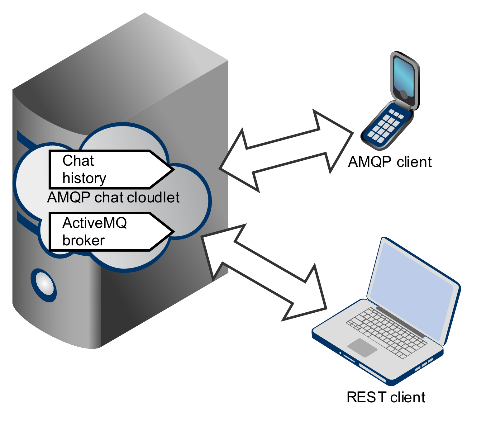

When you connect to the external ActiveMQ broker (using `BROKER_URL` option), the architecture of the example becomes
more like the following diagram:

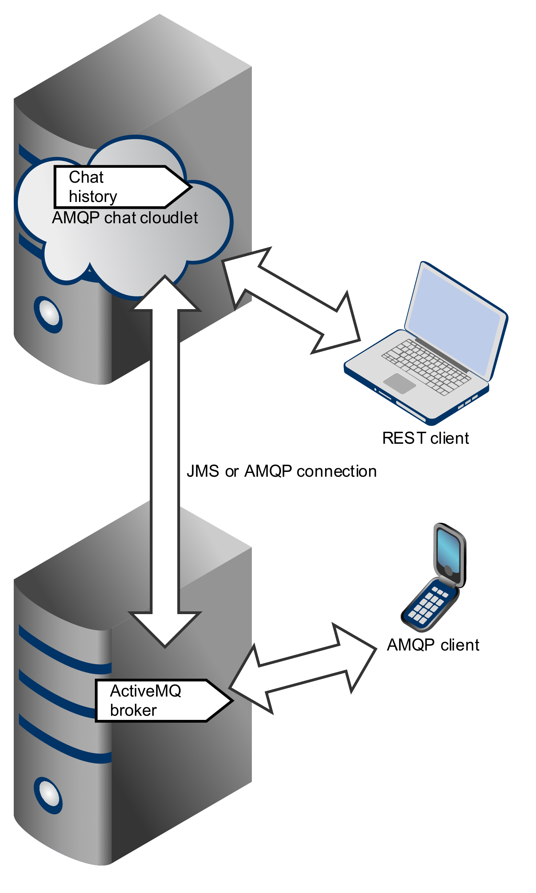

### MQTT cloudlet quickstart

The MQTT cloudlet quickstart can be used as a base for the fat-jar MQTT microservices.

#### Creating and running the MQTT cloudlet project

In order to create the MQTT cloudlet project execute the following commands:

    git clone git@github.com:rhiot/quickstarts.git
    cp -r quickstarts/cloudlets/mqtt mqtt
    cd mqtt
    mvn install

To start the MQTT cloudlet execute the following command:

    java -jar target/rhiot-cloudlets-mqtt-1.0.0-SNAPSHOT.jar

You can also build and run it as a Docker image (we love Docker and recommend this approach):

    TARGET_IMAGE=yourUsername/rhiot-cloudlets-mqtt
    mvn install docker:build docker:push -Ddocker.image.target=${TARGET_IMAGE}
    docker run -it ${TARGET_IMAGE}

#### MQTT broker

By default MQTT cloudlet quickstart starts embedded [ActiveMQ](http://activemq.apache.org) MQTT broker (on
1883 port). If you would like to connect your cloudlet application to the external ActiveMQ broker (instead of starting
the embedded one), run the cloudlet with the `BROKER_URL` environment variable or system property, for example:

    java -DBROKER_URL=tcp://amqbroker.example.com:61616 -jar target/rhiot-cloudlets-mqtt-1.0.0-SNAPSHOT.jar

...or...

    docker run -e BROKER_URL=tcp://amqbroker.example.com:61616 -it yourUsername/rhiot-cloudlets-mqtt

#### Sample chat application

The MQTT cloudlet quickstart is in fact a simple chat application. Clients can send the messages to the chat channel
by subscribing to the broker and sending the messages to the `chat` MQTT topic. To send some messages to the chat you
can use the standalone [MQTT.js](https://www.npmjs.com/package/mqtt) client:

    mqtt pub -t 'chat' -h 'localhost' -m 'Hello, this is the IoT device!'
    mqtt pub -t 'chat' -h 'localhost' -m 'I just wanted to say hello!'
    mqtt pub -t 'chat' -h 'localhost' -m 'Hello, IoT device. Nice to meet you!'

The clients can subscribe to the chat updates
by listening on the `chat-updates` MQTT topic - whenever the new message has been sent to the chat, the clients registered
to the `chat-updates` will receive the updated chat history.

The quickstart also exposed the simple REST API that can be used to read the chat history using the HTTP `GET` request:

    $ curl http://localhost:8181/chat
    Hello, this is the IoT device!
    I just wanted to say hello!
    Hello, IoT device. Nice to meet you!

#### Architectural overview

When MQTT cloudlet is started with the embedded ActiveMQ broker, the architecture of the example is the following:

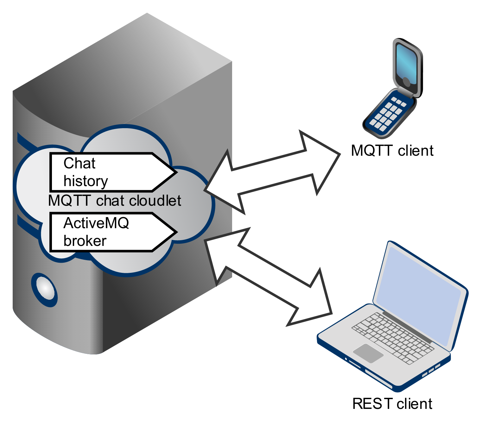

When you connect to the external ActiveMQ broker (using `BROKER_URL` option), the architecture of the example becomes
more like the following diagram:

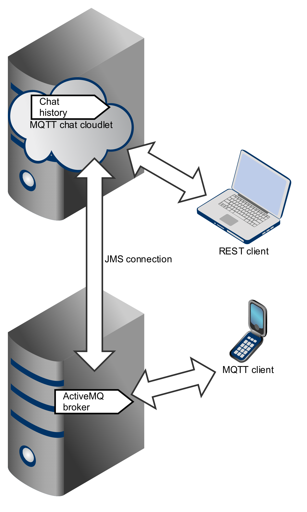

## Articles, presentations & videos

Here is the bunch of useful resources regarding Camel IoT project:
- [Make Your IoT Gateway WiFi-Aware Using Camel and Kura](http://java.dzone.com/articles/make-your-iot-gateway-wifi) - DZone article by Henryk Konsek (2015)
- [IoT gateway dream team - Eclipse Kura and Apache Camel](http://www.slideshare.net/hekonsek/io-t-gateway-dream-team-eclipse-kura-and-apache-camel) - slides from the Henryk Konsek talk for Eclipse IoT Virtual Meetup (2015)
- [IoT gateway dream team - Eclipse Kura and Apache Camel](https://www.youtube.com/watch?v=mli5c-oTN1U) - video from the Henryk Konsek talk for Eclipse IoT Virtual Meetup (2015)
- [Apache Camel & RaspberryPi PoC w/ GPIO & LED & Button](http://gautric.github.io/blog/2015/04/03/apache-camel-raspberrypi-integration.html) - Greg's blog post (video included) (April 2015) 
- [Using Camel & Tinkerforge in Jboss Fuse](https://www.youtube.com/watch?v=J1hN9NLLbro) - Interview with Geert, includes live demo of Camel loadbalancer via RGB Led Strip (October 2014)
- [Rhiot (ex-Camel IoT Labs) i2c gpio mqtt lcd](http://gautric.github.io/blog/2015/05/20/camel-iot-labs-i2c-gpio-mqtt-lcd.html) - Greg's blog post (video included) (may 2015)
- [Running Camel-Tinkerforge on Karaf](https://geertschuring.wordpress.com/2015/05/25/running-camel-tinkerforge-on-karaf/) - Blogpost describing how to install and run camel-tinkerforge on Karaf. Geerts blog (may 2015)
- [Over-the-Air Runtime Updates of the IoT Gateways](http://java.dzone.com/articles/over-air-runtime-updates-iot) - DZone article by Henryk Konsek (2015)
- [Where Am I? Collecting GPS Data With Apache Camel](https://dzone.com/articles/where-am-i-collecting-gps-data-with-apache-camel) - DZone article by Henryk Konsek (2015)
- [Let's start the Rhiot](http://henryk-konsek.blogspot.com/2015/07/lets-start-rhiot.html) - blog post by Henryk Konsek (2015)
- [Howto use your MacOS webcam w/ Rhiot project and groovy] (http://gautric.github.io/blog/2015/10/22/rhiot-0.1.2-camel-webcam-macos-x.html) - Greg's blog post (image included) (oct 2015)
