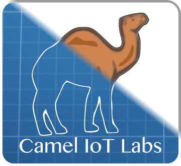
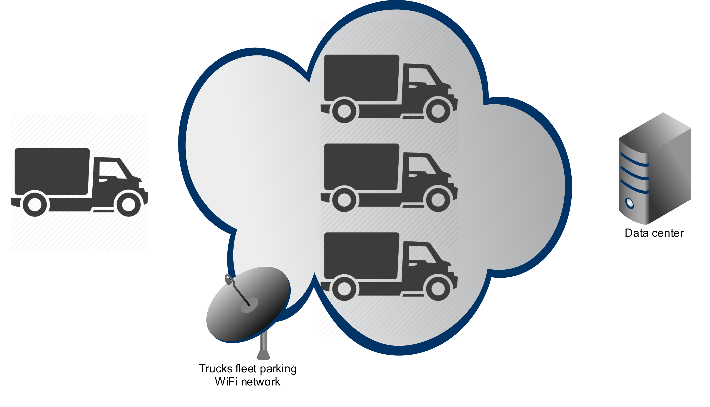

# Camel IoT Labs

Camel IoT Labs project covers modules providing the Internet Of Things functionalities related to the 
[Apache Camel](http://camel.apache.org).
  

## Camel IoT gateway

Camel IoT gateway is the small fat jar application that can be installed into the field device. Gateway acts as a bridge
between the sensors and the data center.

### Installing gateway on the Rasbian

In order to install Camel IoT gateway on the Raspbian, execute the following command:

    bash <(curl https://raw.githubusercontent.com/camel-labs/camel-labs/master/iot/initd/rasbian/get-camel-labs-iot-gateway-rasbian.sh)
    
Or the same remotely using SSH:

    ssh pi@$YOUR_RASPBERRY_PI_DEVICE 'bash <(curl https://raw.githubusercontent.com/camel-labs/camel-labs/master/iot/initd/rasbian/get-camel-labs-iot-gateway-rasbian.sh)'
    
From this point forward Camel IoT gateway will be installed on your device as `camel-iot-gateway` service and started
whenever the device boots up.

## Camel IoT components

Camel IoT Labs brings some extra components for the Apache Camel intended to make both device- and server-side IoT
development easier.

---

### Camel Kura Wifi component

The common scenario for the mobile IoT Gateways, for example those mounted on the trucks or other vehicles, is to cache
collected data locally on the device storage and synchronizing the data with the data center only when trusted WiFi
access point is available near the gateway. Such trusted WiFi network could be localized near the truck fleet parking.
Using this approach, less urgent data (like GPS coordinates stored for the further offline analysis) can be delivered to 
the data center without the additional cost related to the GPS transmission fees.

 

Camel Kura WiFi component can be used to retrieve the information about the WiFi access spots available within the device
range. Under the hood Kura Wifi component uses Kura `org.eclipse.kura.net.NetworkService`. Kura WiFi component
supports both the consumer and producer endpoints.

#### Maven dependency

Maven users should add the following dependency to their POM file:

    <dependency>
      <groupId>com.github.camel-labs</groupId>
      <artifactId>camel-kura</artifactId>
      <version>0.0.0</version>
    </dependency>
    
#### URI format

    kura:networkInterface/ssid
    
Where both `networkInterface` and `ssid` can be replaced with the `*` wildcard matching respectively all the network 
interfaces and SSIDs.

For example to read all the SSID available near the device, the following route can be used:

    from("kura:*/*").to("mock:SSIDs");

The Kura WiFi consumer returns the list of the `org.eclipse.kura.net.wifi.WifiAccessPoint` classes returned as a result
of the WiFi scan:

    WifiAccessPoint[] accessPoints = consumerTemplate.receiveBody("kura:wlan0/*", WifiAccessPoint[].class);
    
You can also request the WiFi scanning using the producer endpoint:

    from("direct:WifiScan").to("kura-wifi:*/*").to("mock:accessPoints");
    
Or using the producer template directly:
 
    WifiAccessPoint[] accessPoints = template.requestBody("kura-wifi:*/*", null, WifiAccessPoint[].class);

#### Options

| Option                    | Default value                                                                 | Description   |
|:------------------------- |:-----------------------------------------------------------------------       |:------------- |
| `accessPointsProvider`    | `com.github.camellabs.iot.component.` `kura.wifi.KuraAccessPointsProvider`    | `com.github.camellabs.iot.component.kura.` `wifi.AccessPointsProvider` strategy instance registry reference used to resolve the list of the access points available to consume. |
| `consumer.initialDelay`   | 1000                                                                          | Milliseconds before the polling starts. |
| `consumer.delay`          | 500 | Delay between each access points scan. |
| `consumer.useFixedDelay`  | false | Set to true to use a fixed delay between polls, otherwise fixed rate is used. See ScheduledExecutorService in JDK for details. |

#### Detecting Kura NetworkService

In the first place `com.github.camellabs.iot.component.kura.wifi.KuraAccessPointsProvider` tries to locate `org.eclipse.kura.net.NetworkService`
in the Camel registry. If exactly one instance of the `NetworkService`  is found (this is usually the case when
if you deploy the route into the Kura container), that instance will be used by the Kura component. Otherwise new instance of the
`org.eclipse.kura.linux.net.NetworkServiceImpl` will be created and cached by the `KuraAccessPointsProvider`.

---

### Camel TinkerForge component

The Camel Tinkerforge component can be used to connect to the TinkerForge brick deamon.

#### Maven dependency

Maven users should add the following dependency to their POM file:

    <dependency>
      <groupId>com.github.camel-labs</groupId>
      <artifactId>camel-tinkerforge</artifactId>
      <version>0.0.0</version>
    </dependency>

#### General URI format

    tinkerforge:<brickletType>?uid=<uid>[&host=<host>][&parameter=value]

The host parameter defaults to localhost. The following values are currently supported as brickletType:

* ambientlight
* temperature
* lcd20x4
* humidity
* io4
* io16
* distance
* ledstrip
* motion
* soundintensity
* piezospeaker
* linearpoti
* rotarypoti
* dualrelay
* solidstaterelay

##### Ambientlight

    from("tinkerforge:ambientlight?uid=al1")
    .to("log:default");

##### Temperature

    from("tinkerforge:temperature?uid=T1")
    .to("log:default");

##### Lcd20x4

The LCD 20x4 bricklet has a character based screen that can display 20 characters on 4 rows.

###### Optional URI Parameters

| Parameter | Default value | Description                              |
|-----------|---------------|------------------------------------------|
| line      | 0             | Show message on line 0                   |
| position  | 0             | Show message starting at position 0      |

    from("tinkerforge:temperature?uid=T1
    .to("tinkerforge:lcd20x4?uid=lcd1&line=2&position=10

The parameters can be overridden for individual messages by settings them as headers on the exchange:

    from("tinkerforge:temperature?uid=T1
    .setHeader("line", constant("2"))
    .setHeader("position", constant("10"))
    .to("tinkerforge:lcd20x4?uid=lcd1");

#### Humidity

     from("tinkerforge:humidity?uid=H1")
     .to("log:default");

#### Io16

The IO16 bricklet has 2 ports (A and B) which both have 8 IO pins. Consuming and producing
messages happens on port level. So only the port can be specified in the URI and the pin will
be a header on the exchange.

##### Consuming:

    from("tinkerforge:io16?uid=io9&ioport=a")
    .to("log:default?showHeaders=true");

##### Producing

    from("timer:default?period=2000")
    .setHeader("iopin", constant(0))
    .setHeader("duration", constant(1000))
    .setBody(constant("on"))
    .to("tinkerforge:io16?uid=io9&ioport=b");

---

### Camel Pi4j component

Camel Pi4j component can be used to manage GPIO and I2C bus features from Raspberry Pi.
This component uses [pi4j](http://pi4j.com) library

#### Maven dependency

Maven users should add the following dependency to their POM file:

    <dependency>
      <groupId>com.github.camel-labs</groupId>
      <artifactId>camel-pi4j</artifactId>
      <version>0.0.0</version>
    </dependency>

#### URI format for GPIO

    pi4j-gpio://gpioId[?options]

*gpioId* must match [A-Z_0-9]+ pattern.
By default, pi4j-gpio uses *RaspiPin* Class, change it via *gpioClass* property
You can use static field name "*GPIO_XX*", pin name "*GPIO [0-9]*" or pin address "*[0-9]*" 

###### Optional URI Parameters

| Parameter            | Default value             | Description                                               |
|----------------------|---------------------------|-----------------------------------------------------------|
| `gpioId`               |                           |                                                           |
| `state`                |                           | Digital Only: if input mode then state trigger event, if output then started value                       |
| `mode`                 | `DIGITAL_OUTPUT`            | To configure GPIO pin mode, Check Pi4j library for more details                     |
| `action`               |                           | Default : use Body if Action for output Pin (TOGGLE, BUZZ, HIGH, LOW for digital only) (HEADER digital and analog) |
| `value`                | `0`                         | Analog or PWN Only                       |
| `shutdownExport`       | `true`                      | To configure the pin shutdown export                      |
| `shutdownResistance`   | `OFF`                       | To configure the pin resistance before exit program                      |
| `shutdownState`        | `LOW`                       | To configure the pin state value before exit program                      |
| `pullResistance`       | `PULL_UP`                   | To configure the input pull resistance, Avoid strange value for info http://en.wikipedia.org/wiki/Pull-up_resistor                     |
| `gpioClass`            | `com.pi4j.io.gpio.RaspiPin` | `class<com.pi4j.io.gpio.Pin>` pin implementation                  |
| `controller`           | `com.pi4j.io.gpio.impl.GpioControllerImpl`            | `instance of <com.pi4j.io.gpio.GpioController>` GPIO controller instance, check gpioClass pin implementation to use the same  |

##### Consuming:

    from("pi4j-gpio://13?mode=DIGITAL_INPUT&state=LOW")
    .to("log:default?showHeaders=true");

##### Producing

    from("timer:default?period=2000")
    .to("pi4j-gpio://GPIO_04?mode=DIGITAL_OUTPUT&state=LOW&action=TOGGLE");
    
    
##### Simple button w/ LED mode

Plug an button on GPIO 1, and LED on GPIO 2 (with Resistor) and code a route like this

    from("pi4j-gpio://1?mode=DIGITAL_INPUT&state=HIGH").id("switch-led")
    .to("pi4j-gpio://2?&action=TOGGLE");

---

### Camel PubNub component

Camel PubNub component can be used to communicate with the [PubNub](http://www.pubnub.com) data stream network for connected devices. 
This component uses [pubnub](https://www.pubnub.com/docs/java/javase/javase-sdk.html) library

#### Maven dependency

Maven users should add the following dependency to their POM file:

    <dependency>
      <groupId>com.github.camel-labs</groupId>
      <artifactId>camel-pubnub</artifactId>
      <version>0.0.0</version>
    </dependency>

#### General URI format

    pubnub://<pubnubEndpointType>:channel[?options]

The following values are currently supported as pubnubEndpointType:

* pubsub
* presence

###### URI Parameters

| Option                    | Default value                                                                 | Description   |
|:------------------------- |:-----------------------------------------------------------------------       |:------------- |
| `publisherKey`            |                      | The punub publisher key optained from pubnub. Mandatory for publishing events              |
| `subscriberKey`           |                      | The punub subsciber key optained from pubnub. Mandatory when subscribing to events         |
| `secretKey`               |                      | The pubnub secret key.
| `ssl`                     | true                 | Use SSL transport. |
| `uuid`                    |                      | The uuid identifying the connection. If not set it will be auto assigned |
| `operation`               | PUBLISH              | Producer only. The operation to perform when publishing events or ad hoc querying pubnub. Valid values are HERE_NOW, WHERE_NOW, GET_STATE, SET_STATE, GET_HISTORY, PUBLISH |

Operations can be used on the producer endpoint, or as a header:

| Operation                 | Description   |
|:------------------------- |:------------- |
| `PUBLISH`                 | Publish a message to pubnub. The message body shold contain a instance of  `org.json.JSONObject` or `org.json.JSONArray`. Otherwise the message is expected to be a string.
| `HERE_NOW`                | Read presence (Who's online) information from the endpoint channel.|  
| `WHERE_NOW`               | Read presence information for the uuid on the endpoint. You can override that by setting the header `CamelPubNubUUID` to another uuid. | 
| `SET_STATE`               | Set the state by uuid. The message body should contain a instance of `org.json.JSONObject` with any state information. By default the endpoint uuid is updated, but you can override that by setting the header `CamelPubNubUUID` to another uuid. |
| `GET_STATE`               | Get the state object `org.json.JSONObject` by for the endpoint uuid. You can override that by setting the `CamelPubNubUUID` header to another uuid. |
| `GET_HISTORY`             | Gets the message history for the endpoint channel. | 

##### Consuming:

Route that consumes messages from mychannel:

    from("pubnub://pubsub:mychannel?uuid=master&subscriberKey=mysubkey").routeId("my-route")
    .to("log:default?showHeaders=true");
    
Route that listens for presence (eg. join, leave, state change) events on a channel

    from("pubnub://presence:mychannel?subscriberKey=mysubkey").routeId("presence-route")
    .to("log:default?showHeaders=true");

##### Producing

Route the collect data and sendt it to pubnub channel mychannel:

    from("timer:default?period=2000").routeId("device-event-route")
    .bean(EventGeneratorBean.class, "getEvent()")
    .convertBodyTo(JSONObject.class)
    .to("pubnub://pubsub:mychannel?uuid=deviceuuid&publisherKey=mypubkey");

---

## Articles, presentations & videos

Here is the bunch of useful resources regarding Camel IoT project:
- [Make Your IoT Gateway WiFi-Aware Using Camel and Kura](http://java.dzone.com/articles/make-your-iot-gateway-wifi) - DZone article by Henryk Konsek (2015)
- [IoT gateway dream team - Eclipse Kura and Apache Camel](http://www.slideshare.net/hekonsek/io-t-gateway-dream-team-eclipse-kura-and-apache-camel) - slides from the Henryk Konsek talk for Eclipse IoT Virtual Meetup (2015)
- [IoT gateway dream team - Eclipse Kura and Apache Camel](https://www.youtube.com/watch?v=mli5c-oTN1U) - video from the Henryk Konsek talk for Eclipse IoT Virtual Meetup (2015)
- [Apache Camel & RaspberryPi PoC w/ GPIO & LED & Button](http://gautric.github.io/blog/2015/04/03/apache-camel-raspberrypi-integration.html) - Greg's blog post (video included) (April 2015) 
